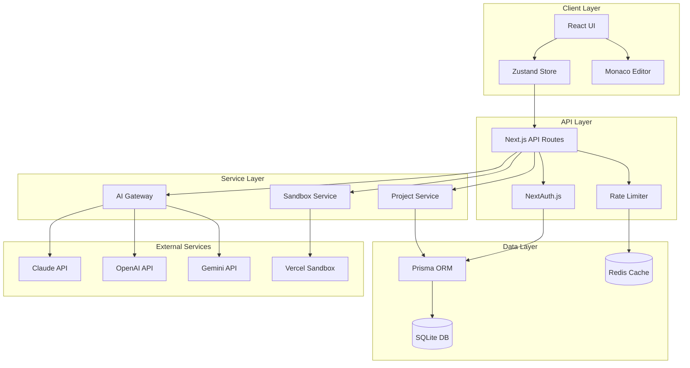
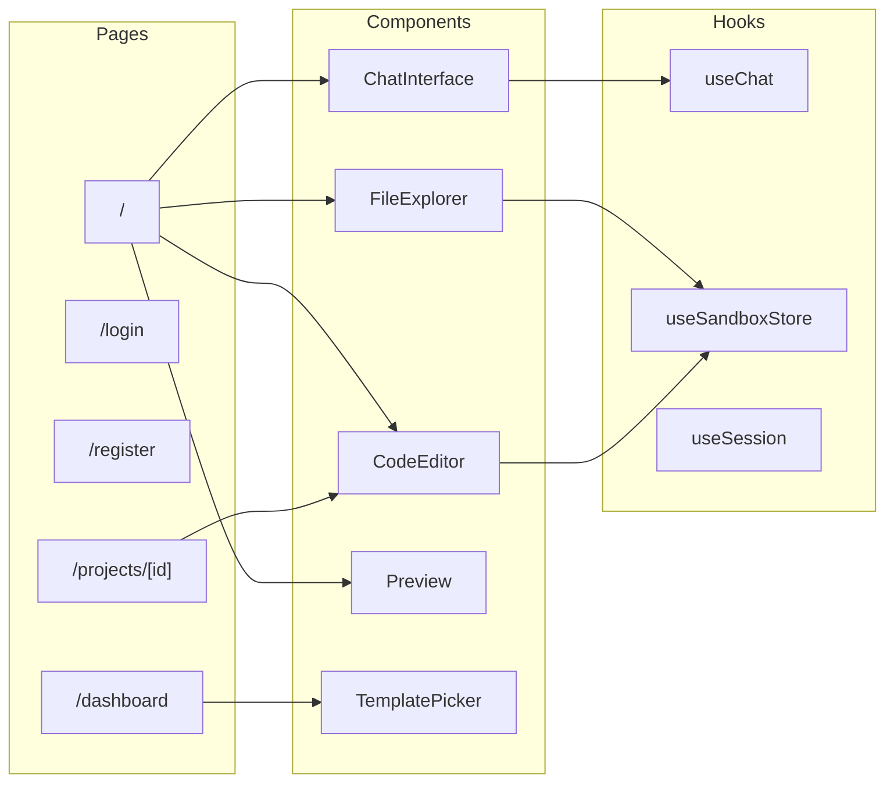
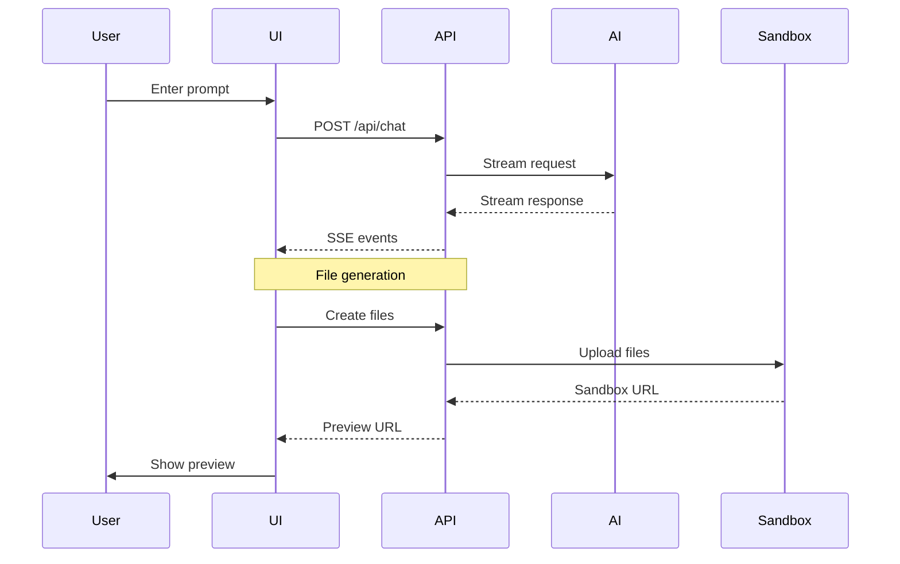
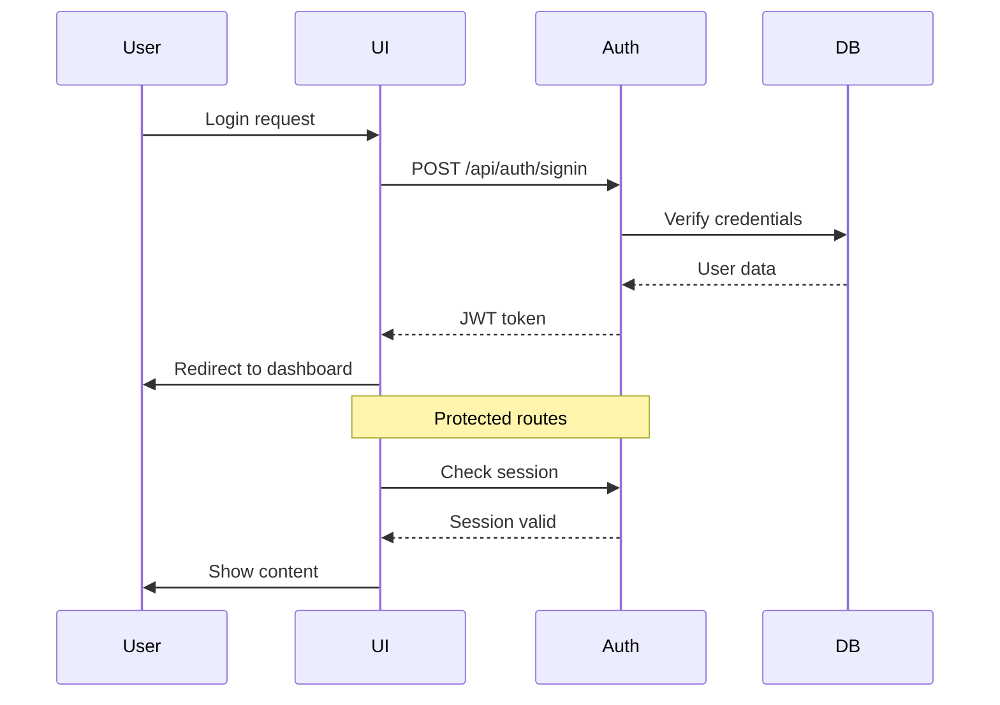
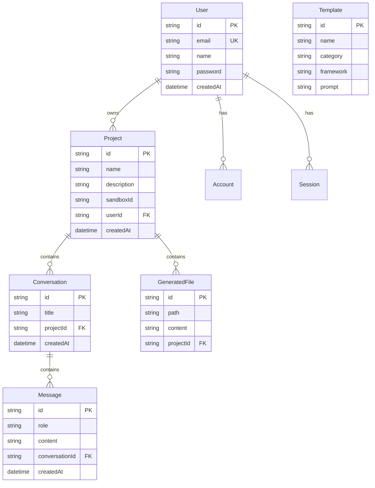
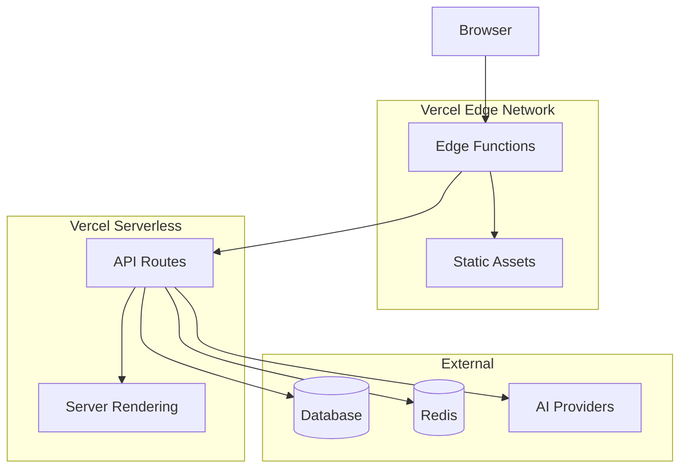
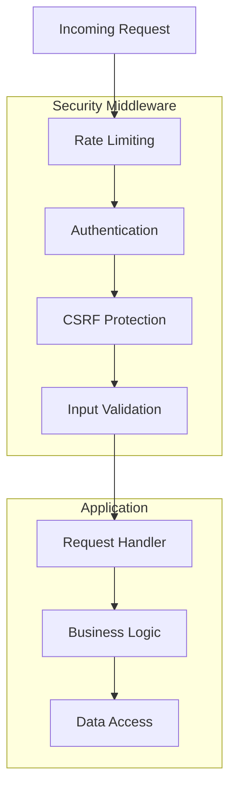

# Vibe Coding Platform - Architecture

## System Overview

## Component Architecture

## Data Flow

## Authentication Flow

## Database Schema

## Deployment Architecture

## Security Layers

## Key Design Decisions

### 1. Monolithic Architecture
- Single Next.js application for simplicity
- API routes co-located with frontend
- Easy deployment to Vercel

### 2. SQLite Database
- Zero configuration required
- Easy migration to PostgreSQL later
- Perfect for development and small deployments

### 3. Server-Sent Events for AI Streaming
- Real-time token streaming
- Better UX than polling
- Efficient resource usage

### 4. Zustand for State Management
- Lightweight and simple
- No boilerplate
- TypeScript friendly

### 5. Monaco Editor Integration
- Full IDE experience
- Syntax highlighting for all languages
- Autocomplete support

## Performance Optimizations

1. **Code Splitting** - Dynamic imports for Monaco Editor
2. **Caching** - Redis for rate limiting, API responses
3. **Streaming** - SSE for AI responses
4. **Edge Caching** - Static assets on Vercel CDN
5. **Database Indexing** - Optimized queries with Prisma

## Scalability Considerations

1. **Horizontal Scaling** - Serverless architecture scales automatically
2. **Database** - Migrate to PostgreSQL + connection pooling
3. **Caching** - Add Redis for session storage
4. **CDN** - Static assets already cached
5. **Rate Limiting** - Per-user limits prevent abuse
