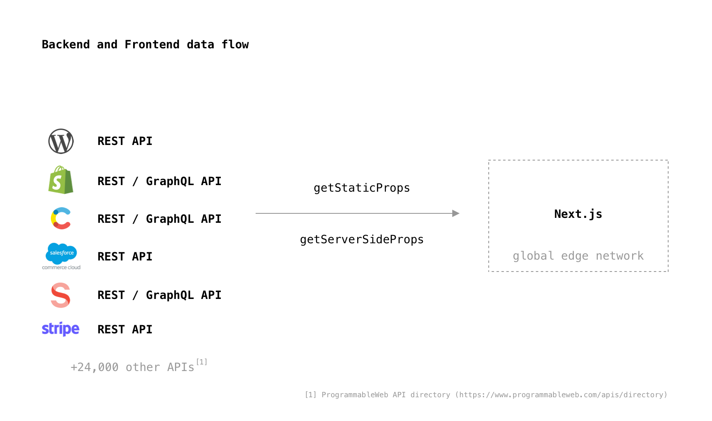
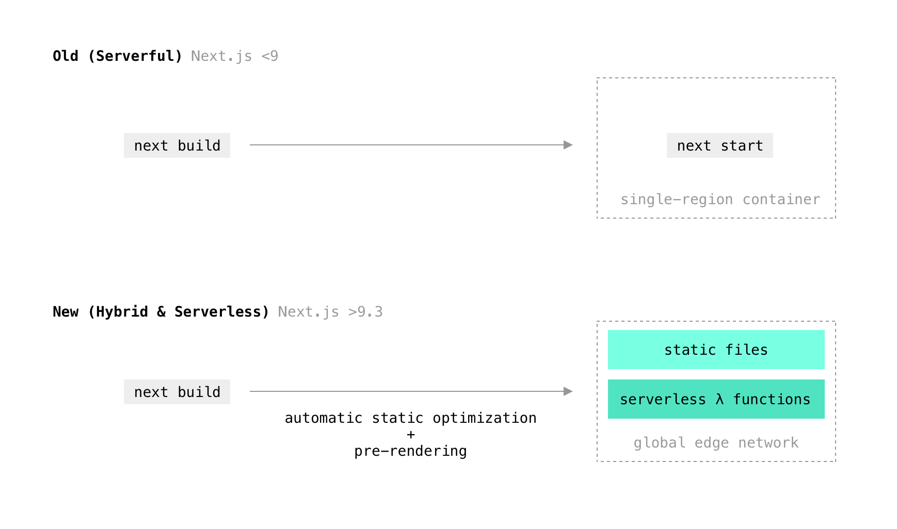
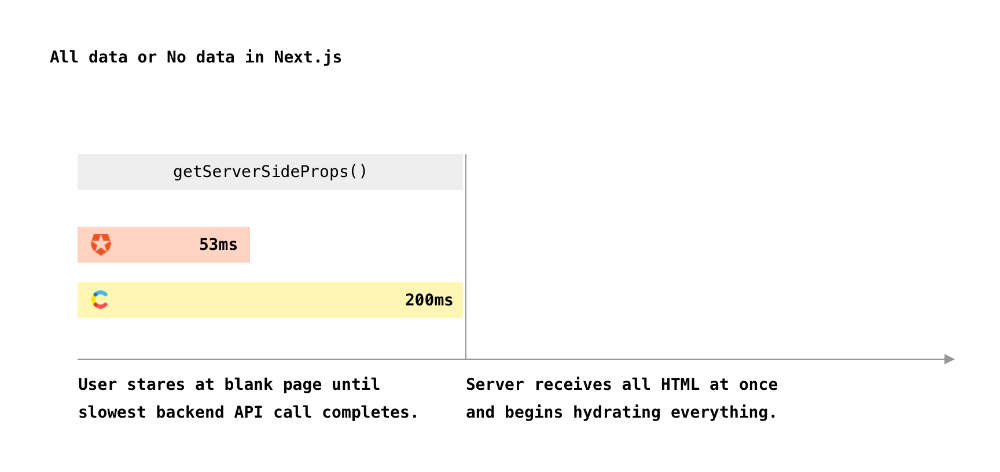
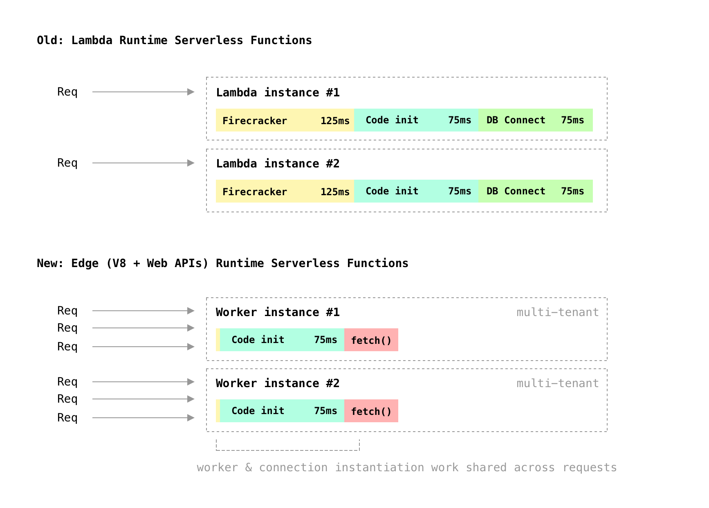
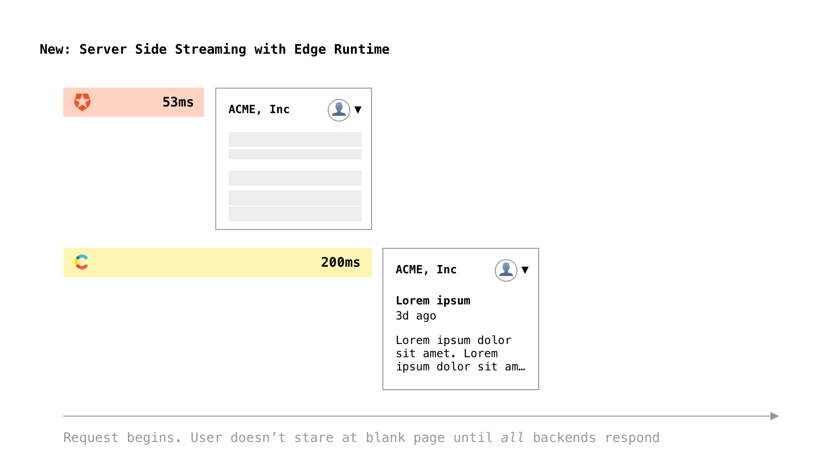
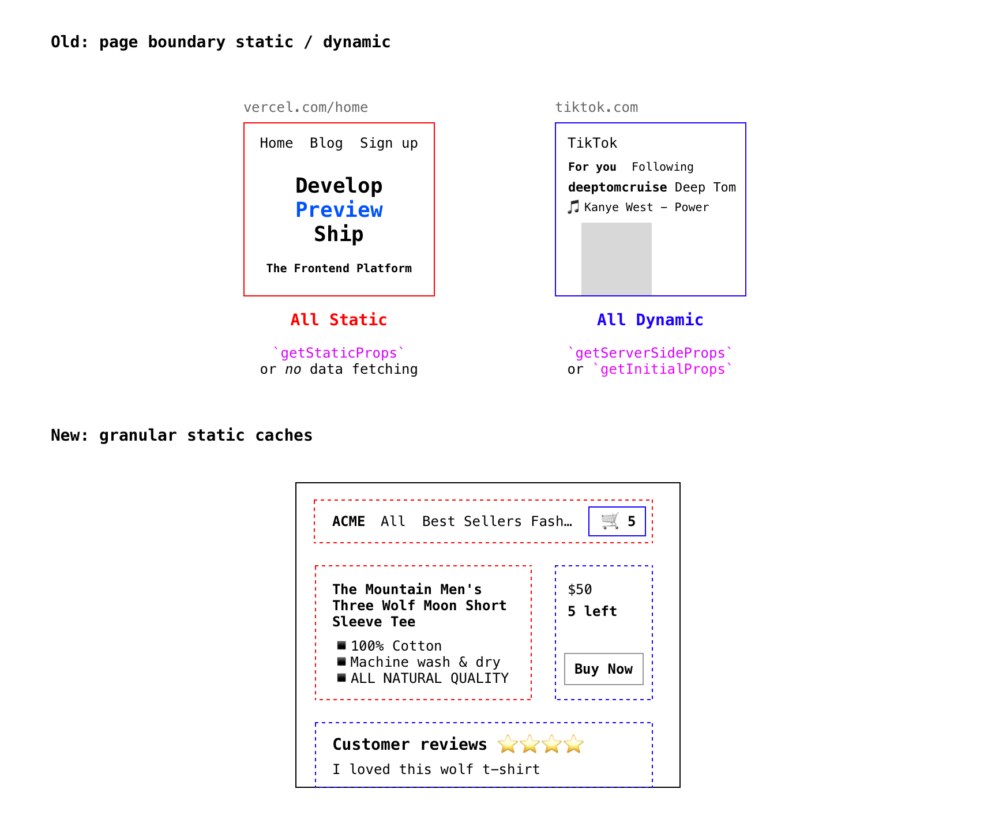
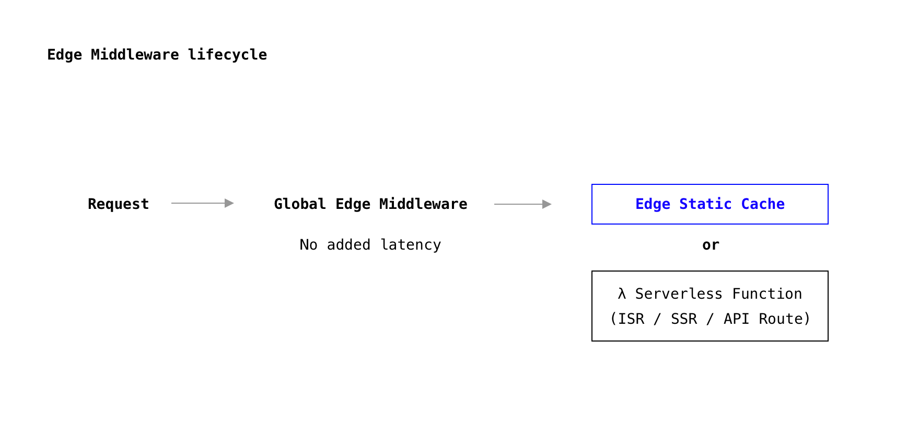

# Next.js Edge (Why?)

This document describes historical background of Next.js and how its APIs (programming model) and the infrastructure to operationalize it will evolve for **modern** frontend development.

**Next.js Edge** describes a new serverless runtime for Next.js that can be incrementally adopted (as new _pages_) or entirely power new frontends. By embracing Next.js Edge you get:

- Optimal **development** performance, not just for `next dev` but also for in-browser realtime collaboration via [Next.js Live](https://nextjs.org/live), by focusing on lazy-loading and near zero transpilation.
- Optimal **runtime** performance, by constraining the API to target **edge (V8) serverless infrastructure** that eliminates cold boots and enables React Server Components streaming.

## Origins and Servers

Next.js was introduced in [October 2016](https://vercel.com/blog/next) and instantly began to rise in popularity, by focusing on both DX and UX:

> We're very proud to open-source Next.js, a small framework for **server-rendered** universal JavaScript webapps built on top of **React, Webpack and Babel**, which **powers this very site**!

Even though [Create React App (CRA)](https://github.com/facebook/create-react-app) had just been open sourced by Facebook themselves to focus on the [React DX problem that was becoming a meme](https://twitter.com/thomasfuchs/status/708675139253174273?lang=en), it didn't have enough focus on UX and therefore not enough business value. If you were counting on SEO, CRA would diminish it. If you wanted optimal loading performance, CRA was a monolithic bundle that made your app always render a spinner. These are problems that CRA is still facing.

The selling points were that you could build a real website with **_multiple_** **_pages_** instead of a single one (_"powers this very site"_), you wouldn't forego pre-rendering for SEO and for good loading performance (_"server-rendered"_), and you'd easily leverage the ecosystem (_"Webpack, Babel"_).

One simple yet critical addition Next.js had in its API surface was its data fetching function: `getInitialProps`, later superseded by `getServerSideProps` and `getStaticProps`.

```js
export async function getServerSideProps() {
  const res = await fetch('<https://api.any-data-provider.com>')
  return { props: await res.body() }
}
```

This positioned Next.js as the ideal frontend framework for any data service(s) in the world: REST APIs, GraphQL APIs, off-the-shelf Headless CMS or e-commerce, or anything that Node.js could talk to (like database connections or gRPC servers), since Node powered the server-rendering.



## Hybrid and Serverless

Next.js launched a few months later than Gatsby, another React-based framework focused on DX, which targeted static generation instead of server rendering. Both Next.js and Gatsby provided alternatives to the tyranny of slow SPAs.

While Next.js took its inspiration in PHP, focusing on being a minimal **meta-framework** and runtime, Gatsby was inspired in WordPress: [themes](https://www.gatsbyjs.com/docs/themes/), [plugins](https://www.gatsbyjs.com/plugins), [admin panel](https://github.com/mxstbr/gatsby/blob/rfc/gatsby-admin/rfcs/text/0000-gatsby-admin.md) all direct analogies.

For the first few years, our interest in static was nearly zero, because "static is a subset of dynamic". If you can solve the dynamic problem, you've by definition solved the static problem.

Due to user demand and undeniable excitement over static sites, we started to incrementally add support for static sites in Next.js. `next export` was introduced to force a site to be exported dynamically as HTML pages. This opened up the usage of Next.js to mediums that require _pure static_ like Electron.

Over time we noticed that many were opting to bypass servers altogether and use the static option, including big companies. There were a few important benefits behind static sites:

- **Automatic CDN.** A "known static" artifact can easily be globally cached and invalidated, without having to be a HTTP or distributed systems expert.
- **Higher availability.** An S3 bucket is less likely to go down than a server and you better tolerate headless CMS or e-commerce API degradation (both in latency and uptime).
- **Lesser cold impact**. If a known-static page is accessed cold, you still respond very quickly, unlike when spinning up container or MicroVM technology on-demand.
- **Lowered costs**. When a site is fully or mostly static, at-scale free services like Vercel's Hobby tier and GitHub Pages become possible, which [foster developer love and virality](https://notfunatparties.substack.com/p/inside-a-viral-website).

Next.js became hybrid: instead of being a monolithic server, `next build` started yielding **optimizable outputs at build time: serverless functions and static assets.**



It's no longer necessary to choose between `next start` and spinning up an always-on web server, or `next export` and only serve statically. Next.js, especially in combination with Vercel, gives you infinitely horizontal scaling SSR via Lambda Functions and Static sites.

Later, we doubled down on hybrid by blurring the lines between a statically built page and a server rendered one with [Incremental Static Regeneration (ISR)](https://www.smashingmagazine.com/2021/04/incremental-static-regeneration-nextjs/). This virtually eliminated a major problem with static site generation: obnoxiously long re-build times for every content change.

## Challenges

### 1️⃣ **Serverless SSR Cold Boots**

When using Next.js deployed to serverless environments, SSR can only realistically be used in conjunction with edge caching for the entire page (see also "[all-or-nothing problem](#all-or-nothing-problem)" below), undoing the dynamism benefits that come with SSR.

Because synchronous SSR execution has steep cold boot latency, which is paid for each concurrent request in Lambda, and significant dollar costs, most SSR workloads today use `Cache-Control` (especially in conjunction with `stale-while-revalidate`) to hide the cold latency and minimize invocations. Solutions like ISR hide the cold boot latency and reuse the output of the rendering to an even greater extent, by recomputing a page and sharing it globally.

There are two very significant obstacles with Node.js-based serverless SSR:

**1.1 MicroVM instantiation overhead**

AWS Lambda is the leading and fastest serverless orchestrator in the world, and yet it's prohibitively slow for SSR workloads without full-page caching. The virtualization technology used under the hood, Firecracker, [proudly advertises](https://firecracker-microvm.github.io/):

> Firecracker initiates user space or application code **in as little as 125 ms**

This means that 125ms of your performance budget is wasted on resource allocation, and that doesn't include all the other cold initialization costs like acquiring and evaluating the user code.

**1.2 Database connection establishment and management**

A persistent problem in the serverless world has been connecting to **_traditional databases_**, while any data source with a HTTP gateway accessed with `fetch` has been mostly spared (like REST & GraphQL APIs).

There are two sides to the problem of connecting to old databases like MySQL or MongoDB:

- **Slow connection establishment.** In addition to the existing cold resource instantiation overhead, many databases involve more than just the TLS handshake `fetch` imposes. In addition, we've seen multiple roundtrips spent in additional handshakes, like roundtrip-heavy authentication and authorization or downloading routing tables or other metadata.
- **No connection reuse and low connection limits**. The fact that serverless environments are constantly tearing down and instantiating new resources across the world minimizes the chance for connection reuse. Node.js and Linux-based serverless runtimes make it impossible to maintain a connection pool shared across instantiations.

These two issues are worsened by the fact that due to the Lambda concurrency model being 1 concurrent request : 1 instance, the cold instantiation and connection latencies are incurred very frequently.

### 2️⃣ All-or-nothing problem

**2.1 All-or-nothing data or no data**

The simplicity of `getServerSideProps` being a function that returns a `Promise` makes SSR only performant for very fast data backends and/or situations where in-process caches can be maintained by the development team, who have to care for invalidation.

In the following example, we could could have given the visitor part of the page when Auth0 responds at **53ms**, but we unnecessarily wait until Contentful responds **147ms later**.



**2.2 All-or-nothing dynamic or static page**

A workaround to the above issue today is to make the page statically pre-rendered for the "public" parts. For example, Contentful is generally used to fetch content that's the same for every user, so we could have pre-rendered the entire blog post page, and then lazy-load the user state on the client side.

Caching the page statically would not only make it automatically replicate to the edge and lower latency, but also reduce the number of backend API calls we'd make to the data provider.

Even in a world of high performance streaming SSR with no cold boots, one would desire those two properties, especially when **_eventual consistency_** is acceptable, which is the case for large parts of e-commerce and media sites.

Today, with Next.js the decision is binary: the page is **_fully_** static and eventually consistent (`getStaticProps`) or **_fully_** dynamic and "strongly" consistent (`getServerSideProps`) with the burden of caching and invalidating placed on the developer.

## Solutions & Directions

### 1️⃣ Ditch Linux, embrace the Web

The Next.js Edge runtime will exclude Linux and all Node.js APIs ([or most of them](https://blog.cloudflare.com/node-js-support-cloudflare-workers/)), and only expose the V8 surface area plus some specific Web APIs, like `fetch`.

[V8 Isolates](https://developers.cloudflare.com/workers/learning/how-workers-works#isolates), unlike Lambdas:

- have a much smaller instantiation overhead in terms of latency
- can be shared across requests (multi-tenant), so we pay instantiation costs less frequently
- places connection management outside of the runtime, so `fetch` is far more efficient



In addition, the Edge Runtime will only support modern ESModules, further enhancing our ability to run Next.js dev workloads directly in the browser via [Next.js Live](https://nextjs.org/live).

### 2️⃣ Streaming and Subtree Caching

The Next.js Edge runtime is capable of streaming HTTP responses, which means we can move away from a single function call that waits until all its underlying data requests complete.

This gets rid of the "all or nothing" problem as far as data fetching goes.



In addition, we can enable developers to still take advantage of global edge caching for the static parts of their application, but we can do it in a more granular way. We get rid of the "all or nothing static or dynamic" problem by allowing them to do it on the subtree level.



The static boundary can still be the entire page, specially for cases where Next.js can automatically detect there's nothing dynamic (e.g.: data fetching that doesn't depend on the request lifecycle).

## The road to Next.js Edge

### 1️⃣ Edge Middleware and `runtime = 'edge'`

First, Next.js will incrementally introduce a new primitive called **Edge Middleware**, which will work on top of all existing Next.js apps (and for customers of Vercel, on top of other frameworks as well.

It consists of a function hook called `middleware`, defined in a module specially named `_middleware.js` (e.g.: `pages/_middleware.js`) and gives customers the equivalent of Express middleware, but deployed globally on top of the fast Edge runtime.

```jsx
// pages/_middleware.js
import { store } from 'next'

export async function middleware(req, res, next) {
  if (req.url.pathname === '/' && (await store.get('featureFlag'))) {
    res.rewrite('/new-homepage')
  } else {
    next()
  }

  fetch('splitbee.io/ingest', { body: req.headers })
}
```



Because Edge Middleware will focus on the **_routing_** phase of the request lifecycle and because of the fast cold performance of the Edge V8 runtime, we can deploy them globally and customers can **fearlessly** add them to their existing apps, without having to worry about data fetching latency, since it won't happen within the context. To expose data to this hook, we'll give customers a simple KV API that's also global.

In addition to introducing Edge Middleware, we'll allow customers to incrementally adopt the faster Edge runtime on top of existing pages using `getServerSideProps`, `getStaticProps` and API routes.

```jsx
export async function getServerSideProps() {
  const res = await fetch('<https://api.shopify.com/graphql>')
  return { props: await res.body() }
}

export const config = {
  runtime: 'edge',
}
```

In the future, we might be able to automatically apply the Edge runtime if we can statically determine that the customer is not depending on Node.js APIs that are not polyfillable in that environment (e.g.: `require('fs')`).

### 2️⃣ React Suspense based caching

Just like `_middleware.js` provides a natural and incremental transition point towards the Edge Runtime, so will React Server Components with the `{page}.server.js` convention. RSC pages will default to (and _enforce_) `runtime = 'edge'`.

Suspense boundaries can be defined with `<Static>` and `<Dynamic>` components that allow us to cache granularly at the edge, with full control for the developer on the **level of fault tolerance and data consistency they desire**.

```jsx
function Content() {
  return (
    <Layout>
      <h2>Hacker News</h2>
      <Static fallback={<Spinner />} revalidate={5}>
        <Sidebar />
      </Static>

      <Dynamic fallback={<Spinner />}>
        <Comments />
      </Dynamic>
    </Layout>
  )
}
```

This allows for colocated data fetching with the component definitions. `<Comments />` above is implemented as:

```jsx
export default function Comments() {
  const comments = useData('/api/comments')
  return (
    <ul>
      {comments.map((comment, i) => (
        <li key={i}>{comment}</li>
      ))}
    </ul>
  )
}
```
