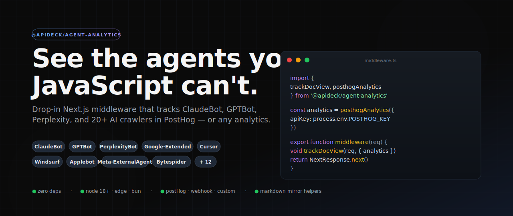

<div align="center">



# Agent Analytics — Next.js starter

### Next.js 15 starter that tracks AI agent traffic in PostHog — drop in your API key, deploy, watch ClaudeBot show up in your dashboard.

**One-click deploy.** Sample `/docs/` routes that serve as HTML to browsers and **clean Markdown to AI agents**. Every Markdown fetch fires a `doc_view` event with `is_ai_bot`, `source`, and `user_agent` — ready to segment in PostHog.

[](https://vercel.com/new/clone?repository-url=https%3A%2F%2Fgithub.com%2Fapideck-libraries%2Fagent-analytics-nextjs-starter&env=NEXT_PUBLIC_POSTHOG_KEY,NEXT_PUBLIC_POSTHOG_HOST&envDescription=PostHog%20project%20API%20key%20and%20host&envLink=https%3A%2F%2Fgithub.com%2Fapideck-libraries%2Fagent-analytics-nextjs-starter%23environment-variables&project-name=agent-analytics-starter&repository-name=agent-analytics-starter)

[**Live demo**](https://agent-analytics-nextjs-starter.vercel.app) · [**@apideck/agent-analytics**](https://github.com/apideck-libraries/agent-analytics) · [**The pattern, explained**](https://addyosmani.com/blog/agentic-engine-optimization/)

</div>

---

## What this template does

AI crawlers don't run JavaScript — so your client-side analytics never see them. This template closes that gap:

1. **`middleware.ts`** uses [`@apideck/agent-analytics`](https://www.npmjs.com/package/@apideck/agent-analytics) to detect 20+ known AI bots (ClaudeBot, GPTBot, PerplexityBot, Google-Extended, Applebot-Extended, Bytespider, Cursor, Windsurf, and more) and capture a `doc_view` event in PostHog on every request.
2. **`/docs/` routes** are served as clean Markdown when an agent asks (via `.md` suffix, `Accept: text/markdown`, or a known bot UA) — otherwise HTML. Same URL, two representations.
3. **Every Markdown response** carries `Content-Signal`, `Vary: accept`, and `x-markdown-tokens` headers so agents can budget context before parsing.

Runs on Vercel's Fluid Compute. Zero infrastructure to manage, events land in PostHog seconds after deploy.

## Quick start

### 1. Deploy

Click the Deploy button above, or:

```bash
npx create-next-app --example https://github.com/apideck-libraries/agent-analytics-nextjs-starter my-app
cd my-app
vercel --prod
```

### 2. Set env vars

In the Vercel deploy prompt (or your project's env settings):

| Variable                   | Required                  | Example                                                                           |
| -------------------------- | ------------------------- | --------------------------------------------------------------------------------- |
| `NEXT_PUBLIC_POSTHOG_KEY`  | yes                       | `phc_xxxxxxxx` — from PostHog project settings                                    |
| `NEXT_PUBLIC_POSTHOG_HOST` | no (defaults to US cloud) | `https://us.i.posthog.com`, `https://eu.i.posthog.com`, or your own reverse-proxy |

If `NEXT_PUBLIC_POSTHOG_KEY` is absent the middleware silently no-ops — nothing breaks, events just don't flow.

### 3. Verify

```bash
# From your local terminal, pointed at the deployment:
curl -A "ClaudeBot/1.0 probe-$(date +%s)" https://<your-deployment>.vercel.app/docs/intro
```

Open PostHog → Activity and filter events by `event = doc_view`. You should see one event with `is_ai_bot: true`, `source: ua-rewrite`, and the probe UA you sent.

---

## How it works

```
 Agent / Browser                 middleware.ts                    PostHog
────────────────   ────────────────────────────────────────   ──────────
      │                                                              │
      │ GET /docs/intro                                               │
      │ Accept: text/markdown (or .md suffix, or AI-bot UA)           │
      ├──────────────────────┐                                        │
      │                      ▼                                        │
      │           markdownServeDecision(req) → reason                 │
      │                      │                                        │
      │     ┌────────────────┴───────────────┐                        │
      │     ▼                                ▼                        │
      │  trackDocView(req, {                NextResponse.rewrite(     │
      │    analytics,                         req.nextUrl → /md/...   │
      │    source: reason,                  )                         │
      │    properties: {...}                                          │
      │  }) ────fire-and-forget──────keepalive fetch──►───────────►   │
      │                                                              │
      │ ◄──── 200 text/markdown ────────────────                     │
      │       Content-Signal, x-markdown-tokens                      │
      │                                                              │
```

Key properties:

- **Fire-and-forget** — the capture is non-blocking. `keepalive: true` lets it survive after the response returns.
- **No person profiles** — `$process_person_profile: false` tells PostHog not to create one per unique bot fingerprint.
- **Stable anon distinct_id** — djb2 hash of `ip:ua` collapses repeat fetches from the same agent into one visitor.

## Structure

```
.
├── middleware.ts               # The star of the show
├── app/
│   ├── layout.tsx
│   ├── page.tsx                # Landing page with probe instructions
│   ├── globals.css
│   └── docs/[slug]/page.tsx    # Human-facing docs (HTML)
├── public/
│   ├── md/docs/
│   │   ├── intro.md            # Agent-facing Markdown mirror
│   │   └── usage.md
│   └── llms.txt                # Agent-friendly site index
├── .env.example
├── package.json
└── README.md
```

## Customising

**Add a new `/docs/` page**:

1. Create `public/md/docs/<slug>.md` — what agents see.
2. Add an entry to the `DOCS` object in `app/docs/[slug]/page.tsx` — what browsers see.
3. Update `public/llms.txt` so agents can discover it.

**Extend the mirror to cover other routes** (e.g. `/blog/*`, `/guides/*`):

Edit `resolveMirrorPath` in `middleware.ts`:

```ts
function resolveMirrorPath(pathname: string): string | null {
  if (pathname.startsWith('/docs/')) return `/md${pathname}.md`
  if (pathname.startsWith('/blog/')) return `/md${pathname}.md` // ← add this
  return null
}
```

Then create matching `public/md/blog/*.md` files.

**Swap analytics backends** — replace the PostHog adapter with a webhook, Mixpanel, or your own callback:

```ts
import { trackDocView, webhookAnalytics } from '@apideck/agent-analytics'

const analytics = webhookAnalytics({
  url: 'https://collector.example.com/events',
  headers: { Authorization: `Bearer ${process.env.COLLECTOR_TOKEN}` },
})
```

Any `{ capture(event) }` object is a valid adapter.

## Environment variables

<a id="environment-variables"></a>

| Variable                   | Description                                                                                                                                                                                             |
| -------------------------- | ------------------------------------------------------------------------------------------------------------------------------------------------------------------------------------------------------- |
| `NEXT_PUBLIC_POSTHOG_KEY`  | PostHog project API key (the public key used by the JS SDK). Find it under _Project settings → Project API Key_.                                                                                        |
| `NEXT_PUBLIC_POSTHOG_HOST` | PostHog ingestion host. Defaults to `https://us.i.posthog.com`. Set to `https://eu.i.posthog.com` for EU cloud, or your own reverse-proxy domain (e.g. `https://svc.example.com`) to dodge ad-blockers. |

## Learn more

- [`@apideck/agent-analytics` on GitHub](https://github.com/apideck-libraries/agent-analytics) — the library powering this template
- [Agentic Engine Optimization](https://addyosmani.com/blog/agentic-engine-optimization/) — the case for agent-ready docs sites
- [contentsignals.org](https://contentsignals.org) — the `Content-Signal` header spec
- [developers.apideck.com](https://developers.apideck.com) — the production docs site this pattern was extracted from

## License

MIT © Apideck
