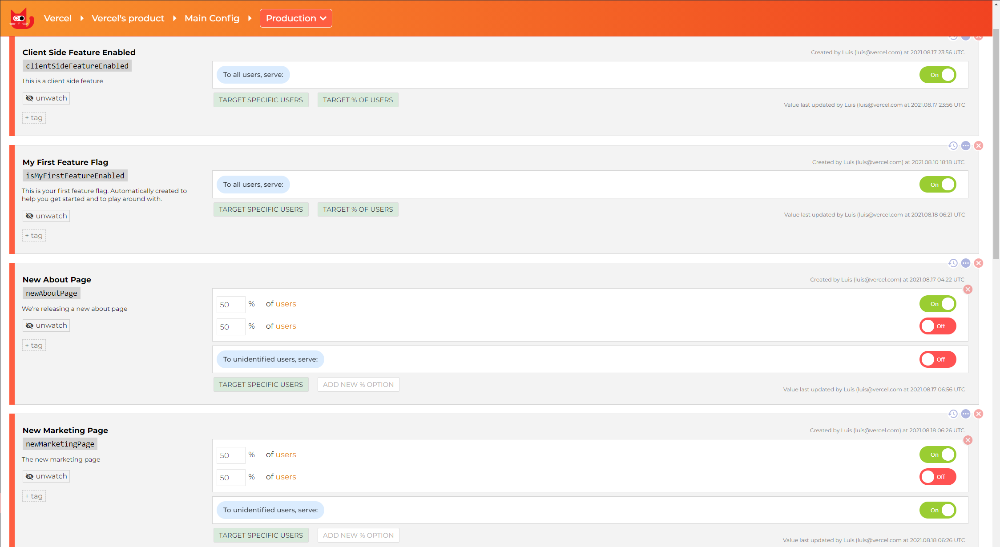

# A/B Testing with ConfigCat

[ConfigCat](https://configcat.com) is a service for feature flag and configuration management. In this demo you'll be able to use feature flags at the edge.

By A/B testing directly on the server-side, you'll reduce layout shift from client-loaded experiments and improving your site's performance with smaller JavaScript bundles.

## Demo

https://edge-functions-feature-flag-configcat.vercel.app

## How to Use

You can choose from one of the following two methods to use this repository:

### One-Click Deploy

Deploy the example using [Vercel](https://vercel.com?utm_source=github&utm_medium=readme):

[](https://vercel.com/new/clone?repository-url=https://github.com/vercel/examples/tree/main/edge-middleware/feature-flag-configcat&env=NEXT_PUBLIC_CONFIGCAT_SDK_KEY,FEATURE_FLAG_ABOUT_PAGE,FEATURE_FLAG_MARKETING_PAGE&project-name=feature-flag-configcat&repository-name=feature-flag-configcat)

### Clone and Deploy

Execute [`create-next-app`](https://github.com/vercel/next.js/tree/canary/packages/create-next-app) with [pnpm](https://pnpm.io/installation) to bootstrap the example:

```bash
pnpm create next-app --example https://github.com/vercel/examples/tree/main/edge-middleware/feature-flag-configcat feature-flag-configcat
```

You'll need to have an account with [ConfigCat](https://app.configcat.com/signup). Once that's done, copy the `.env.example` file in this directory to `.env.local` (which will be ignored by Git):

```bash
cp .env.example .env.local
```

Then open `.env.local` and set the SDK key to match the one in your ConfigCat dashboard. Your key should be right under your feature flags.

The demo uses the following 4 feature flags, make sure to add them to your ConfigCat environment:



Next, run Next.js in development mode:

```bash
pnpm dev
```

The `/about` and `/marketing` pages each have a `_middleware.ts` file that takes care of doing the AB testing for each page, using a different feature in ConfigCat.

The index page ([pages/index.tsx](pages/index.tsx)) also shows how to do AB testing under the same path, in SSR and client-side.

We fetch and save the feature flags in JSON at build time to avoid doing any kind of data fetching at the edge, check [scripts/configcat.js](scripts/configcat.js) to see how it works.

Deploy it to the cloud with [Vercel](https://vercel.com/new?utm_source=github&utm_medium=readme&utm_campaign=edge-middleware-eap) ([Documentation](https://nextjs.org/docs/deployment)).
