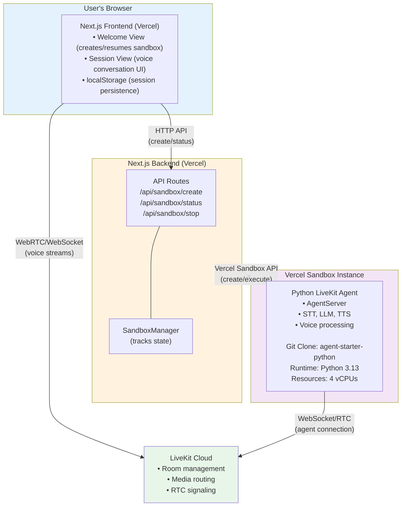

# Voice Agent with Vercel Sandbox

A Next.js application that creates on-demand voice AI agents using Vercel Sandbox. Each user session spawns an isolated Python agent environment that handles real-time voice conversations through LiveKit.

<picture>
  <source srcset="./.github/assets/readme-hero-dark.webp" media="(prefers-color-scheme: dark)">
  <source srcset="./.github/assets/readme-hero-light.webp" media="(prefers-color-scheme: light)">
  
</picture>

## Features

- **On-Demand Agent Creation**: Spins up isolated Python voice agents in Vercel Sandboxes
- **Session Persistence**: Resume conversations after page reloads
- **Real-Time Progress**: Visual feedback during agent initialization
- **Auto-Cleanup**: Sandboxes automatically expire after configurable timeout
- **Voice Interaction**: Real-time voice chat powered by LiveKit
- **Multi-Modal Support**: Camera video streaming and screen sharing
- **Customizable**: Configurable branding, colors, and UI text

## Architecture



### How It Works

1. User clicks "Start call" in browser
2. Frontend calls `/api/sandbox/create`
3. Backend creates Vercel Sandbox with Python agent from [agent-starter-python](https://github.com/livekit-examples/agent-starter-python)
4. Sandbox clones repository, installs dependencies, starts agent
5. Agent connects to LiveKit Cloud and waits in room
6. Frontend polls `/api/sandbox/status` for progress
7. When ready, frontend connects user to LiveKit room
8. User and agent communicate through LiveKit Cloud
9. After 10 minutes (configurable), Sandbox expires automatically

### Key Components

- **Frontend**: Next.js app with React hooks for sandbox lifecycle management
- **Backend API**: Creates and monitors Vercel Sandboxes
- **SandboxManager**: Tracks active sandboxes and handles cleanup
- **Vercel Sandbox**: Ephemeral environment running Python voice agent
- **LiveKit Cloud**: Handles real-time voice/video communication

## Prerequisites

- Node.js 18+
- Vercel account with Sandbox API access
- LiveKit Cloud account ([sign up](https://cloud.livekit.io))
- API keys for voice services:
  - [AssemblyAI](https://www.assemblyai.com/) (speech-to-text)
  - [OpenAI](https://platform.openai.com/) (language model)
  - [Cartesia](https://cartesia.ai/) (text-to-speech)

## Getting Started

### 1. Clone the Repository

```bash
git clone https://github.com/livekit-examples/agent-starter-react.git
cd agent-starter-react
```

### 2. Install Dependencies

```bash
npm install
# or
pnpm install
```

### 3. Configure Environment Variables

Copy the example environment file:

```bash
cp .env.example .env.local
```

Edit `.env.local` with your credentials:

```env
# LiveKit credentials - Required for voice agent functionality
LIVEKIT_API_KEY=your_api_key
LIVEKIT_API_SECRET=your_api_secret
LIVEKIT_URL=wss://your-project.livekit.cloud

# Vercel Sandbox Configuration
# For local development: Set these manually
# For production: OIDC token is automatically managed by Vercel
VERCEL_TEAM_ID=your_team_id
VERCEL_PROJECT_ID=your_project_id
VERCEL_TOKEN=your_access_token

# Agent Configuration
AGENT_REPO_URL=https://github.com/livekit-examples/agent-starter-python.git
AGENT_RUNTIME=python3.13
SANDBOX_TIMEOUT=600000

# Enable sandbox mode
NEXT_PUBLIC_USE_SANDBOX=true

# AI Service API Keys (passed to Python agent)
OPENAI_API_KEY=your_openai_key
ASSEMBLYAI_API_KEY=your_assemblyai_key
CARTESIA_API_KEY=your_cartesia_key
```

### 4. Run the Development Server

```bash
npm run dev
# or
pnpm dev
```

Open [http://localhost:3000](http://localhost:3000) in your browser.

### 5. Deploy to Vercel

Click the button below to deploy your own instance:

[](https://vercel.com/new/clone?repository-url=https://github.com/livekit-examples/agent-starter-react)

After deployment:

1. Add all environment variables from `.env.local` to your Vercel project settings
2. Ensure your Vercel account has Sandbox API access enabled
3. The app will automatically use Vercel's OIDC token in production

## Configuration

### App Configuration (`app-config.ts`)

Customize branding, features, and UI text:

```typescript
export const APP_CONFIG_DEFAULTS: AppConfig = {
  companyName: 'Your Company',
  pageTitle: 'Voice Agent Demo',
  pageDescription: 'Talk to an AI agent',

  supportsChatInput: true,
  supportsVideoInput: true,
  supportsScreenShare: true,
  isPreConnectBufferEnabled: true,

  logo: '/your-logo.svg',
  accent: '#000000',
  logoDark: '/your-logo-dark.svg',
  accentDark: '#ffffff',
  startButtonText: 'Start call',

  // Vercel Sandbox Configuration
  useVercelSandbox: true,
  sandboxAgentRepo: 'https://github.com/livekit-examples/agent-starter-python.git',
  sandboxRuntime: 'python3.13',
};
```

### Sandbox Configuration

Modify sandbox behavior in `.env.local`:

- `AGENT_REPO_URL`: Git repository containing your Python agent
- `AGENT_RUNTIME`: Python or Node.js runtime (`python3.13`, `node24`, `node22`)
- `SANDBOX_TIMEOUT`: Time in milliseconds before sandbox expires (default: 10 minutes)

### Customizing the Python Agent

The default agent uses [agent-starter-python](https://github.com/livekit-examples/agent-starter-python). To customize:

1. Fork or clone the repository
2. Modify `src/agent.py` to change agent behavior
3. Update voice models, instructions, or add custom tools
4. Push changes to your Git repository
5. Update `AGENT_REPO_URL` in `.env.local`

## Project Structure

```
sandbox-voice-agent/
├── app/
│   ├── api/
│   │   └── sandbox/
│   │       ├── create/route.ts      # Creates Vercel Sandboxes
│   │       ├── status/route.ts      # Polls sandbox status
│   │       └── stop/route.ts        # Stops sandboxes
│   ├── (app)/
│   └── layout.tsx
├── components/
│   ├── app/
│   │   ├── app.tsx                  # Main app component
│   │   ├── welcome-view.tsx         # Sandbox creation UI
│   │   ├── session-view.tsx         # Voice conversation UI
│   │   └── sandbox-loading.tsx      # Progress indicator
│   └── livekit/                     # LiveKit components
├── hooks/
│   └── useSandboxCreation.ts        # Sandbox lifecycle hook
├── lib/
│   ├── sandbox-manager.ts           # Server-side sandbox tracking
│   └── utils.ts
├── types/
│   └── sandbox.ts                   # TypeScript definitions
├── app-config.ts                    # App configuration
└── package.json
```

## Key Files

### Sandbox Management

- **`hooks/useSandboxCreation.ts`**: React hook managing sandbox creation, polling, and session persistence
- **`lib/sandbox-manager.ts`**: Server-side manager tracking active sandboxes and handling cleanup
- **`app/api/sandbox/create/route.ts`**: API endpoint creating Vercel Sandboxes and installing agents
- **`app/api/sandbox/status/route.ts`**: API endpoint for checking sandbox readiness

### Frontend Components

- **`components/app/welcome-view.tsx`**: Initial view with "Start call" button
- **`components/app/session-view.tsx`**: Voice conversation interface
- **`components/app/sandbox-loading.tsx`**: Progress indicator with status messages

## Troubleshooting

### Sandbox creation fails

**Symptoms**: Error message "Failed to create sandbox"

**Solutions**:
- Verify `VERCEL_TOKEN` has Sandbox API access
- Check `AGENT_REPO_URL` is accessible (public or token-authenticated)
- Ensure `LIVEKIT_API_KEY` and `LIVEKIT_API_SECRET` are correct

### Agent joins room but doesn't respond

**Symptoms**: Connection successful but no voice response

**Solutions**:
- Verify AI service API keys are set: `OPENAI_API_KEY`, `ASSEMBLYAI_API_KEY`, `CARTESIA_API_KEY`
- Check browser console for permission errors (microphone access)
- Review agent logs in Vercel Sandbox dashboard

### Multiple sandboxes created

**Symptoms**: Several sandboxes appear in Vercel dashboard

**Solutions**:
- Check `localStorage` for stuck sessions (clear browser storage)
- Verify `isCheckingExisting` state prevents duplicate creation
- Ensure button is disabled during sandbox check

### Page reload creates new sandbox

**Symptoms**: Lost connection after refresh

**Solutions**:
- Verify `localStorage` persistence is working
- Check sandbox hasn't expired (default: 10 minutes)
- Increase `SANDBOX_TIMEOUT` if needed

## Development

### Running Tests

```bash
npm test
```

### Building for Production

```bash
npm run build
```

### Linting and Formatting

```bash
npm run lint
npm run format
```

## How Session Persistence Works

The app uses `localStorage` to track active sandboxes:

1. When sandbox becomes ready, stores `{ sandboxId, timestamp }` in localStorage
2. On page load, checks for existing session less than 10 minutes old
3. Verifies sandbox still exists via `/api/sandbox/status`
4. If valid and ready, resumes connection instead of creating new sandbox
5. Clears storage when sandbox expires or user ends call

This prevents users from accidentally creating multiple sandboxes during a single conversation.

## Performance Considerations

- **Cold Start**: Initial sandbox creation takes 20-40 seconds (dependency installation)
- **Warm Resume**: Resuming existing sandbox takes 2-3 seconds (verification only)
- **Concurrent Users**: Each user gets isolated sandbox (no resource contention)
- **Cleanup**: Automatic expiration prevents zombie sandboxes

## Security

- Sandbox environment is isolated per user
- API keys never exposed to client
- LiveKit tokens generated server-side
- Vercel OIDC authentication in production

## Contributing

Contributions are welcome! Please open issues or pull requests on GitHub.

Join the [LiveKit Community Slack](https://livekit.io/join-slack) for discussions and support.

## License

This project is open source under the Apache 2.0 license.

## Resources

- [LiveKit Agents Documentation](https://docs.livekit.io/agents)
- [Vercel Sandbox Documentation](https://vercel.com/docs/sandbox)
- [LiveKit JavaScript SDK](https://github.com/livekit/client-sdk-js)
- [Agent Starter Python](https://github.com/livekit-examples/agent-starter-python)
