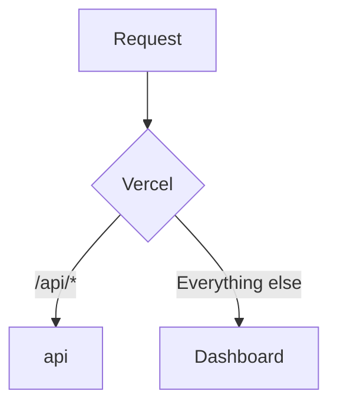

# SaaS Microservices

This is an example SaaS project with 2 API services defined as microservices.

## Getting Started

```sh
pnpm install
pnpm dev
```

Open http://localhost:3024 to view the dashboard. The dashboard will make API calls
to the `api` service for the information to display in the dashboard.

## How It Works

There are 2 separate applications in this example:

- `dashboard` - A [Next.js](https://nextjs.org/) application to show the UI. This application also controls the `microfrontends.json` configuration to route API paths to the other microservices (see below).
- `api` - An [Express.js](https://expressjs.com/) backend serving data displayed in the dashboard.

These all run under the same domain. Paths to each application are routed using Vercel's [microfrontends](https://vercel.com/docs/microfrontends) support:



## Running Locally

To run all applications together, run:

```sh
pnpm dev
```

A [local development proxy](https://vercel.com/docs/microfrontends/local-development) is automatically run to stitch requests from each application to the local instance of each service.

A single or subset of applications can also be run:

```sh
pnpm dev:dashboard
pnpm dev:api
pnpm turbo run dev -F api -F dashboard
```
