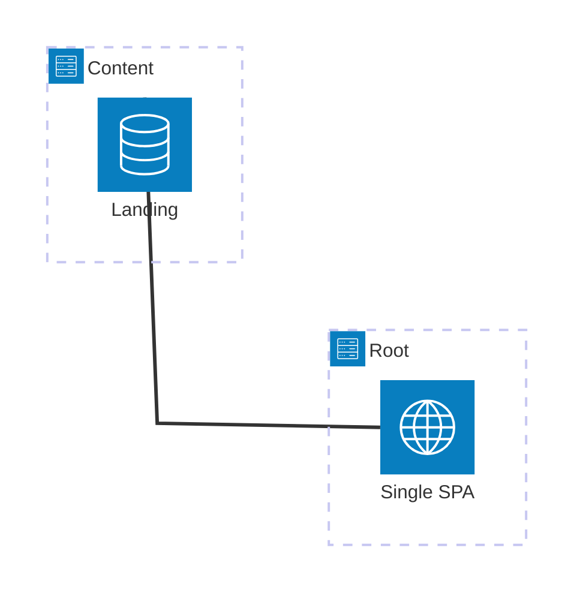

<picture>
  <source srcset="https://assets.vercel.com/image/upload/v1689795055/docs-assets/static/docs/microfrontends/mfe-banner-dark.png" media="(prefers-color-scheme: dark)">
  <source srcset="https://assets.vercel.com/image/upload/v1689795055/docs-assets/static/docs/microfrontends/mfe-banner-light.png" media="(prefers-color-scheme: light)">
  
</picture>

This example demonstrates using [single-spa](https://single-spa.js.org/) with [Module Federation](https://module-federation.io/) on Vercel using [Vercel Microfrontends](https://vercel.com/docs/microfrontends). The application consists of two microfrontends that allows you to load multiple applications in a single page, enabling independent deployments and development.

Demo URL: https://microfrontends-single-spa-module-federation-root.labs.vercel.dev/

## 🚀 Deploy to Vercel

Deploy each microfrontend independently to experience the full power of distributed development:

| Application | Description                                                           | Deploy                                                                                                                                                                                                                                               |
| ----------- | --------------------------------------------------------------------- | ---------------------------------------------------------------------------------------------------------------------------------------------------------------------------------------------------------------------------------------------------- |
| Root        | Main shell application orchestrating single-spa and Module Federation | [](https://vercel.com/new/clone?repository-url=https:%2F%2Fgithub.com%2Fvercel%2Fexamples&project-name=single-spa-root-microfrontend&root-directory=microfrontends%2Fsingle-spa%2Fapps%2Froot)       |
| Content     | Content microfrontend exposing landing page components                | [](https://vercel.com/new/clone?repository-url=https:%2F%2Fgithub.com%2Fvercel%2Fexamples&project-name=single-spa-content-microfrontend&root-directory=microfrontends%2Fsingle-spa%2Fapps%2Fcontent) |

## Getting Started

### Prerequisites

To run the example, you will need the following prerequisites:

- [Node.js](https://nodejs.org/) installed on your machine.
- [pnpm](https://pnpm.io/) package manager installed.
- [Git](https://git-scm.com/) installed to clone the repository.

It is also recommended to have:

- Familiarity with [single-spa](https://single-spa.js.org/) and [Module Federation](https://module-federation.io/) concepts.
- Basic understanding of [Vercel](https://vercel.com/) deployment process.
- A Vercel account to deploy the microfrontend applications.

### Local Development Setup

Follow these steps to set up the example on your local machine. Make sure you have the prerequisites installed before proceeding.

1. **Clone the repository:**

   ```sh
   git clone https://github.com/vercel/examples.git
   cd microfrontends/single-spa
   ```

2. **Install dependencies:**

   ```sh
   pnpm install
   ```

3. **Start the development environment:**

   ```sh
   pnpm dev
   ```

   This command starts all applications simultaneously:

   - Root app
   - Content app

4. **Access the application:**

   Open [http://localhost:3024](http://localhost:3024) in your browser to see the federated application where components from different microfrontends are composed together using single-spa and Module Federation.

### Key Components

1. **Root Application (`apps/root/`)**

   - Acts as the shell application and single-spa orchestrator
   - Dynamically imports components from content remotes
   - Manages the overall application layout and routing with single-spa
   - Configures federated remotes and manages dependencies

2. **Content Application (`apps/content/`)**

   - Exposes content-related components through Module Federation
   - Provides federated page components wrapped with single-spa lifecycle
   - Maintains its own styling and component logic
   - Mounted as a single-spa application in the root

3. **Shared Packages (`packages/`)**
   - Common TypeScript configurations across all applications
   - Shared ESLint rules and formatting standards
   - Ensures consistency across all microfrontends

### Architecture Flow



## Microfrontends configuration

The microfrontends are configured using the `microfrontends.json` file. This file defines the applications and their routing. The example uses the following configuration:

```jsonc
// apps/root/microfrontends.json
{
  "$schema": "https://openapi.vercel.sh/microfrontends.json",
  "applications": {
    "single-spa-root-microfrontend": {
      "development": {
        "fallback": "microfrontends-single-spa-module-federation-root.vercel.app",
      },
    },
    "single-spa-content-microfrontend": {
      "routing": [
        {
          "paths": ["/_content/:path*"],
        },
      ],
    },
  },
}
```

This configuration is defined in the root application, which is the default application of the microfrontends group. The `microfrontends.json` file specifies the applications and their routing paths. The `development.fallback` field is used to specify a fallback URL. See more details on how to manage your microfrontends in the [Managing Microfrontends](https://vercel.com/docs/microfrontends/managing-microfrontends) documentation.

The `microfrontends.json` in this example defines three applications:

- `single-spa-root-microfrontend`: The root application that serves as the entry point for the microfrontend architecture. This is the default application of the Microfrontends group.
- `single-spa-content-microfrontend`: A microfrontend application that handles content-related functionality. It is routed to paths starting with `/_content/`. The application will provide the landing page content for our example.

As we don't specify a specific local Microfrontends proxy port, the local Microfrontends proxy will run on port `3024` by default. You can change this by setting `localProxyPort` in the `microfrontends.json` file.

## Vite configuration

To make Microfrontends and Module Federation work, we need to configure Vite in each microfrontend application.

For the `content` application providing the Module Federation remotes for the root application, we need to set up the Vite configuration as follows:

```ts {11,15,19} filename="apps/content/vite.config.ts"
import { defineConfig, type Plugin } from 'vite';
import { federation } from '@module-federation/vite';
import tailwindcss from '@tailwindcss/vite';
import { microfrontends } from '@vercel/microfrontends/experimental/vite';
import react from '@vitejs/plugin-react';

export default defineConfig({
  plugins: [
    tailwindcss(),
    microfrontends({
      basePath: '/_content',
    }) as Plugin,
    react(),
    federation({
      name: 'content',
      manifest: true,
      filename: 'remoteEntry.js',
      exposes: {
        './landing': './src/landing.tsx',
      },
      shared: {
        react: {
          singleton: true,
        },
        'react/': {
          singleton: true,
        },
        'react-dom': {
          singleton: true,
        },
        'react-dom/': {
          singleton: true,
        },
      },
    }) as Plugin[],
  ],
  build: {
    target: 'chrome89',
  },
});
```

Both configurations use the `@module-federation/vite` plugin to set up Module Federation and the `@vercel/microfrontends/experimental/vite` plugin to enable microfrontends support. The `federation` plugin is used to expose the components of the microfrontend applications, while the `microfrontends` plugin is used to configure the base path for the microfrontend routing.

React and React DOM are shared as singletons to ensure that the same instance is used across the microfrontends. This is important for maintaining a consistent state and avoiding issues with multiple instances of React.

The additional specification for a `build.target` is set to `chrome89` to ensure compatibility with the features used in the microfrontends. In this case we need top-level await support, which is available in Chrome 89 and later.

For the root application, we need to set up the Vite configuration to load the microfrontends and use the exposed components from the `content` application:

```ts {17-28} filename="apps/root/vite.config.ts"
import { defineConfig, type Plugin } from 'vite';
import { federation } from '@module-federation/vite';
import tailwindcss from '@tailwindcss/vite';
import { microfrontends } from '@vercel/microfrontends/experimental/vite';
import { vercelToolbar } from '@vercel/toolbar/plugins/vite';
import react from '@vitejs/plugin-react';

export default defineConfig({
  plugins: [
    tailwindcss(),
    microfrontends() as Plugin,
    vercelToolbar(),
    react(),
    federation({
      name: 'root',
      manifest: true,
      remotes: {
        content: {
          type: 'module',
          name: 'content',
          entry: '/_content/remoteEntry.js',
        },
      },
      shared: {
        react: {
          singleton: true,
        },
        'react/': {
          singleton: true,
        },
        'react-dom': {
          singleton: true,
        },
        'react-dom/': {
          singleton: true,
        },
      },
    }) as Plugin[],
  ],
  build: {
    target: 'chrome89',
  },
});
```

The root application exposes some components, and it loads the and `content` application as a remote using Module Federation. The `remotes` configuration specifies the entry points for the remote applications, which are the `remoteEntry.js` files exposed by the `content` application.

## Root application

The root application is the entry point for the microfrontend architecture. It is responsible for loading the remotes and rendering their components as single-spa applications.

To create a layout for the root application using single-spa, we can use the following HTML structure:

```html {11-13} filename="apps/root/index.html"
<!doctype html>
<html lang="en">
  <head>
    <meta charset="UTF-8" />
    <meta name="viewport" content="width=device-width, initial-scale=1.0" />
    <title>Company Landing Page</title>
    <link rel="stylesheet" href="./src/globals.css" />
    <script type="module" src="./src/index.ts"></script>
  </head>
  <body className="flex min-h-screen flex-col">
    <div id="single-spa-application:header"></div>
    <div id="single-spa-application:content"></div>
    <div id="single-spa-application:footer"></div>
  </body>
</html>
```

To register each application with single-spa, we can use the following code in the `src/index.ts` file of the root application:

```ts {7,13,19} filename="apps/root/src/index.ts"
import { mountVercelToolbar } from '@vercel/toolbar/vite';
import { registerApplication, start } from 'single-spa';
import './globals.css';

registerApplication(
  'header',
  () => import('./header'),
  () => true,
);

registerApplication(
  'footer',
  () => import('./footer'),
  () => true,
);

registerApplication(
  'content',
  () => import('content/landing'),
  () => true,
);

start();
mountVercelToolbar();
```

We register each single-spa application using the `registerApplication` function. Each application is registered with a name, a loading function that imports the remote component using dynamic ES module import, and an activity function that determines when the application should be active based on the current route, which will be always true in the case of this example.

## Remote applications

In the remote applications, we are using `single-spa-react` to create a React component that will be rendered by single-spa. The `content` application provides the main page content, while the `root` application provides the header and footer components.

We need to define the `bootstrap`, `mount`, and `unmount` functions for each component. These functions are used by single-spa to manage the lifecycle of the applications.

```tsx {13} filename="apps/content/src/index.tsx"
import React from 'react';
import ReactDOMClient from 'react-dom/client';
import singleSpaReact from 'single-spa-react';
import './globals.css';

function Landing(): React.JSX.Element {
  return <>{/* ... */}</>;
}

export const { bootstrap, mount, unmount } = singleSpaReact({
  React,
  ReactDOMClient,
  rootComponent: Landing,
  errorBoundary() {
    return <></>;
  },
});
```

## Local development

With everything needed set up, you can now run the microfrontend applications locally. The root application will be available at `http://localhost:3024`, and it will load the `content` application as a microfrontend.

To start a development server for each application, we use a `dev` npm script in each application's `package.json` file. The `dev` script uses Vite to start the development server for the application and also specifies the port to run on when using the Microfrontends proxy.

```jsonc
// apps/root/package.json
{
  "scripts": {
    "build": "vite build",
    "dev": "vite --port $(microfrontends port)",
    "start": "vite preview --port $(microfrontends port)",
  },
}
```

Run the following command in the root directory of the cloned repository to start the development server and the Microfrontends proxy:

```sh
pnpm dev
```

This command will start all the applications in the monorepo and also starts the Microfrontends proxy on port `3024`.

📚 [Documentation](https://vercel.com/docs/microfrontends)
