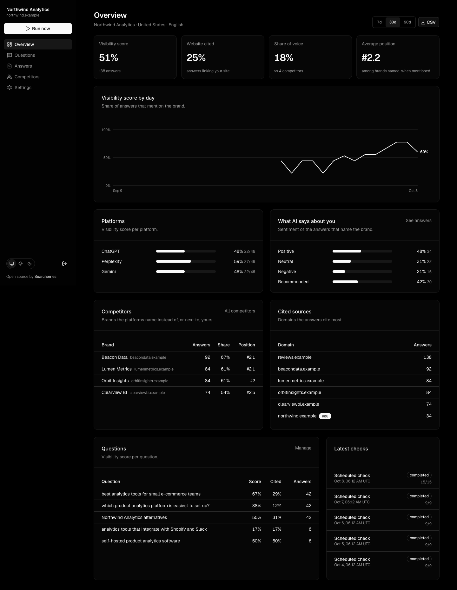

# AI Visibility Tracker

Track how **ChatGPT, Perplexity, Gemini, Claude and Grok** answer the questions your customers ask: whether they mention your brand, cite your website, which competitors they recommend instead, and what they say about each one.

Self-hosted, open source, and deliberately small. One Vercel AI Gateway key covers every platform, each platform answers with its **own native web search**, and the whole thing deploys to Vercel with one click.

[](https://vercel.com/new/clone?repository-url=https%3A%2F%2Fgithub.com%2Feduardmur%2Fai-visibility-tracker&project-name=ai-visibility-tracker&repository-name=ai-visibility-tracker&env=ADMIN_PASSWORD,CRON_SECRET&envDescription=ADMIN_PASSWORD%20protects%20the%20dashboard.%20CRON_SECRET%20protects%20the%20daily%20check%20%28any%20long%20random%20string%29.&envLink=https%3A%2F%2Fgithub.com%2Feduardmur%2Fai-visibility-tracker%23configuration&products=%5B%7B%22type%22%3A%22integration%22%2C%22group%22%3A%22postgres%22%7D%5D)

Built and maintained by [Searcherries](https://searcherries.com?utm_source=github&utm_medium=readme&utm_campaign=ai-visibility-tracker), the team behind the hosted AI visibility platform of the same name. This repository is the self-hosted version: your keys, your database, your rules. The hosted product collects with a hybrid approach: the vendors' APIs with web search, on the models each platform currently serves its users by default, plus UI-level tracking of Google AI Overviews. It also adds Search Console, Google Analytics and Bing data and an MCP server for Claude, Codex and Cursor; see [Hosted version](#hosted-version) below.



## What you get

- **Visibility score** per period, platform and question: the share of answers that mention your brand.
- **Citations**: which answers link to your site, and which domains the platforms cite instead.
- **Competitors**: every brand the answers name as an alternative, with share of voice, average position, sentiment and the exact statements made about it.
- **Answers**: the full text of every answer, its sources and the searches the platform ran, exportable as CSV.
- **Checks on a schedule**: daily questions run every day, weekly ones once a week, plus a _Run now_ button.

Everything about _your_ brand is decided by plain text matching over the stored answer, never by a model, so each number can be reproduced from the data in your own database. A small model call only extracts the _other_ brands an answer names and what it says about them.

[Live demo](https://ai-visibility-tracker-demo.vercel.app) with sample data (read-only).

## Deploy to Vercel in five minutes

1. Click **Deploy with Vercel** above. It clones this repository, lets you pick a Postgres database from the Vercel Marketplace (Neon has a free tier), and asks for two values:
   - `ADMIN_PASSWORD`: the password for the dashboard.
   - `CRON_SECRET`: any long random string (`openssl rand -hex 32`). Vercel Cron uses it for the daily check.
2. Open the deployment, sign in, enter your brand, website and market, and pick the platforms.
3. Add a few questions your customers would ask an AI assistant and press **Run now**. Answers appear within a minute.

No AI key is needed on Vercel: the app authenticates to the [AI Gateway](https://vercel.com/ai-gateway) with the deployment's own identity (OIDC). **The gateway does need a positive balance**: open your Vercel team → AI Gateway → Credits and add funds before the first check, otherwise every platform request fails. You pay the providers' list prices with no markup; see [Costs](#costs).

> The Hobby plan runs cron jobs once a day with a one-hour window and stops functions after 300 seconds. The tracker is built for exactly that: the daily check is split into batches that re-invoke themselves until every answer is in.

## Run it locally

```bash
git clone https://github.com/eduardmur/ai-visibility-tracker
cd ai-visibility-tracker
npm install
cp .env.example .env.local   # set ADMIN_PASSWORD and AI_GATEWAY_API_KEY
npm run dev
```

Open http://localhost:3000. The gateway key belongs to a Vercel team, and that team's AI Gateway balance must be positive (Vercel → AI Gateway → Credits) or requests fail. Without `DATABASE_URL` the app uses an embedded Postgres ([PGlite](https://pglite.dev)) stored in `./data/pglite`, so there is nothing else to install. Point `DATABASE_URL` at any Postgres to use that instead.

Useful scripts:

| Command                                                | What it does                                                                   |
| ------------------------------------------------------ | ------------------------------------------------------------------------------ |
| `npm run dev`                                          | Development server                                                             |
| `npm run build`                                        | Applies migrations, then builds (Vercel runs this)                             |
| `npm test`                                             | Unit and integration tests (no network)                                        |
| `npm run smoke -- "your question" "Brand" "brand.com"` | Live check of every available platform plus the extractor. Spends a few cents. |
| `npm run seed:demo`                                    | Fills an empty database with a demo brand and two weeks of synthetic answers   |
| `npm run db:generate`                                  | Generates a migration after changing `src/lib/db/schema.ts`                    |

## How it works

**Collection.** For each question and platform, the app sends the question with a short answer contract ("answer in under 350 words, name the relevant brands, cite sources") and the platform's native search tool:

| Platform   | Default model                 | Search                                      |
| ---------- | ----------------------------- | ------------------------------------------- |
| ChatGPT    | `openai/gpt-5.4-nano`         | OpenAI `web_search` tool                    |
| Perplexity | `perplexity/sonar`            | built into the model                        |
| Gemini     | `google/gemini-3-flash`       | Google Search grounding                     |
| Claude     | `anthropic/claude-haiku-4.5`  | Anthropic web search, one search per answer |
| Grok       | `xai/grok-4.20-non-reasoning` | xAI web search, budgeted to one search      |

Model ids are gateway ids (`creator/model`). Change them on the Settings page (stored in the database) or with environment variables (`MODEL_CHATGPT`, `MODEL_CLAUDE`, …); the Settings page wins, then the environment, then these defaults. The answer text, the sources the platform returned and the searches it ran are stored verbatim.

These are the vendors' API models with web search, which is what makes one key and one code path possible. They are close to, but not identical with, the consumer apps.

**Analysis.** For every stored answer:

1. _Brand mentioned_: word-boundary match of the brand name and its aliases in the answer text.
2. _Website cited_: a source or a link in the text points at your domain (subdomains included).
3. _Brands named_: one structured-output call (`openai/gpt-4o-mini` by default, changeable in Settings) lists every brand in the answer with sentiment, whether it is recommended, whether it competes with you, and up to three statements made about it. Any brand the answer recommends for the question counts as a competitor regardless of the model's own verdict. Spellings are merged (`Otterly.ai` = `OtterlyAI`), generic words are dropped, and a website is only attributed to a brand when the domain matches its name.
4. _Position_: the order in which the brands first appear in the text, computed from the text, not from the model.

**Scores** (all over the completed answers of the selected period):

- Visibility score = answers mentioning the brand ÷ answers.
- Website cited = answers citing the domain ÷ answers.
- Share of voice = answers mentioning the brand ÷ (that + answers naming each competitor).
- Average position = mean rank among the brands named, over answers that mention the brand.

## Costs

The app itself is free. You pay the model providers through the gateway at list price, and the bill depends entirely on the models you pick in Settings: web search is what costs, so a model with a cheap search tool and a small answer stays in the cents per check, while Claude and Grok cost several times more per answer than the default trio. Each check is one call per question per platform plus one small extraction call per answer, so ten questions on three platforms every day means about a thousand calls a month.

Current per-token prices are on the [AI Gateway model list](https://vercel.com/ai-gateway/models), and the gateway dashboard shows what each check actually cost. The default selection is three platforms for that reason; add Claude and Grok when the budget allows, and switch questions to weekly to cut the bill further.

## Configuration

| Variable                                                                                                   | Required  | Purpose                                                                                                                                      |
| ---------------------------------------------------------------------------------------------------------- | --------- | -------------------------------------------------------------------------------------------------------------------------------------------- |
| `ADMIN_PASSWORD`                                                                                           | yes       | Dashboard password. Changing it signs everyone out.                                                                                          |
| `CRON_SECRET`                                                                                              | on Vercel | Protects `/api/cron/daily` and the background processor. Vercel Cron sends it automatically. Locally an ephemeral secret is generated.       |
| `DATABASE_URL`                                                                                             | on Vercel | Postgres connection string (the Deploy button provisions Neon). Empty locally = embedded PGlite.                                             |
| `AI_GATEWAY_API_KEY`                                                                                       | locally   | One key for every platform. Empty on Vercel = OIDC. Either way the Vercel team's AI Gateway balance must be positive.                        |
| `OPENAI_API_KEY`, `ANTHROPIC_API_KEY`, `GOOGLE_GENERATIVE_AI_API_KEY`, `XAI_API_KEY`, `PERPLEXITY_API_KEY` | no        | Direct vendor access, used only when no gateway key is set and the app is not on Vercel. A platform is available when its vendor key exists. |
| `MODEL_CHATGPT`, `MODEL_PERPLEXITY`, `MODEL_GEMINI`, `MODEL_CLAUDE`, `MODEL_GROK`, `MODEL_EXTRACTOR`       | no        | Model defaults for a deployment. Values saved on the Settings page take precedence.                                                          |
| `APP_URL`                                                                                                  | no        | Public URL, used when the processor re-invokes itself. Defaults to the request origin.                                                       |
| `RUN_BATCH_BUDGET_MS`                                                                                      | no        | Wall-clock budget of one processing invocation (default 140 000). Raise it on Vercel Pro together with `maxDuration`.                        |
| `DEMO_MODE`                                                                                                | no        | `1` turns a deployment into a public read-only demo with sample data seeded at build time. Never set it on a real tracker.                   |

Bring your own keys and skip the gateway if you prefer: set the vendor keys instead of `AI_GATEWAY_API_KEY`. The same prompts, tools and parsing apply; only the transport changes.

## How runs work

A _check_ (run) is one row per question × platform. `POST /api/internal/runs/{id}/process` answers `202` immediately and then works through pending rows four at a time, stopping after `RUN_BATCH_BUDGET_MS` to stay inside the function limit, and calls itself again while rows remain. Claims are atomic, so overlapping invocations never process the same row twice, and a row left "running" by a killed function is retried once after ten minutes.

The daily cron (`vercel.json`, 06:00 UTC) creates a run with every question that is due and starts the same processor. If a run stalls, the run page offers **Resume**.

## Hosted version

Don't want to run it yourself? [Searcherries](https://searcherries.com?utm_source=github&utm_medium=readme&utm_campaign=ai-visibility-tracker) is the hosted version from the same team, from $13/month, model costs included. Collection is hybrid: the vendors' APIs with web search on the models each platform serves its users by default, plus UI-level tracking of Google AI Overviews. It adds Search Console, Google Analytics and Bing data per project, calibrated answer insights, and an MCP server so Claude, Codex, Cursor and Claude Code can work on your visibility with your own numbers.

## Development

```bash
npm test            # vitest, uses an in-memory PGlite database
npm run typecheck
npm run lint
```

The UI is [shadcn/ui](https://ui.shadcn.com) (neutral palette, Radix primitives) with the [Geist](https://vercel.com/font) font and a system/light/dark theme switch; the trend chart is a small hand-written SVG so the only chart dependency is React.

The code is organised so the moving parts stay separate:

- `src/lib/ai/` talks to the models (provider selection, per-platform tools, prompts, source normalisation, extraction).
- `src/lib/analysis/` is pure: mention detection, brand identity, scoring.
- `src/lib/runs/` creates and processes checks.
- `src/lib/queries/` reads the database for the pages.
- `src/app/` is the Next.js App Router UI, with server actions in `src/app/actions/` and route handlers in `src/app/api/`.
- `src/components/ui/` holds the shadcn/ui primitives; `src/components/blocks.tsx` the few composites built on them.

Contributions are welcome. Keep the project small: one key, one code path per platform, numbers reproducible from the stored answers.

## License

MIT.
