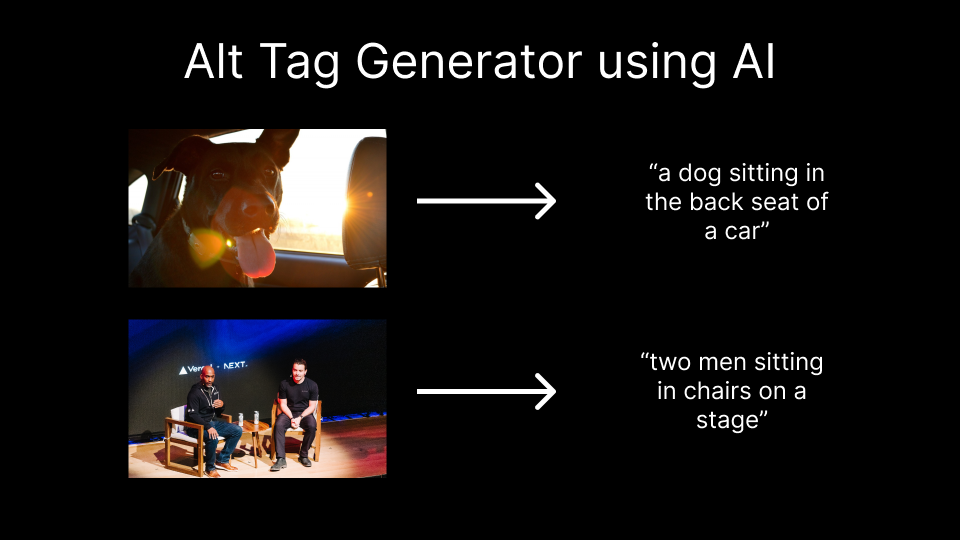

# Alt Image Generator

This project will generate relevant alt text for images using AI.



## How it works

It uses an ML modal from Salesforce called [BLIP](https://github.com/salesforce/BLIP) on [Replicate](https://replicate.com/) to generate relevant alt text for images. You can feed the Next.js API route an image as a query param and it will return a one sentence description of that image.

## Clone and Deploy

Execute [`create-next-app`](https://github.com/vercel/next.js/tree/canary/packages/create-next-app) with [pnpm](https://pnpm.io/installation) to bootstrap the example:

```bash
pnpm create next-app --example https://github.com/vercel/examples/tree/main/solutions/alt-tag-generator
```

After cloning the repo, go to [Replicate](https://replicate.com/) to make an account and put your API key in a file called `.env.local`.

Then, run the application in the command line and it will be available at `http://localhost:3000`.

```bash
pnpm dev
```

To use the API route, go to the link below in your browser or run a curl command in your terminal to get a sample result. Feel free to replace the dub.sh link with a link to any image.

```bash
curl http://localhost:3000/api/generate?imageUrl=https://dub.sh/confpic
```

## One-Click Deploy

Deploy the example using [Vercel](https://vercel.com?utm_source=github&utm_medium=readme&utm_campaign=vercel-examples):

[](https://vercel.com/new/clone?repository-url=https://github.com/vercel/examples/tree/main/solutions/alt-tag-generator&env=REPLICATE_API_TOKEN&project-name=alt-tag-generation&repo-name=alt-tag-generation)
