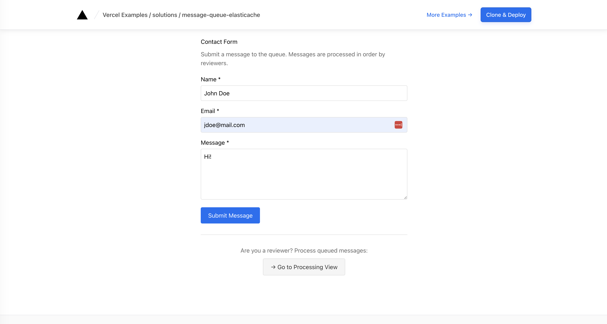
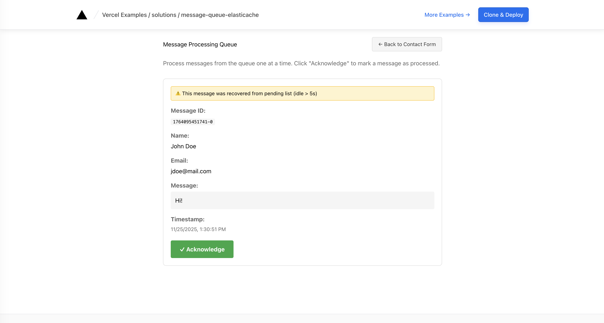
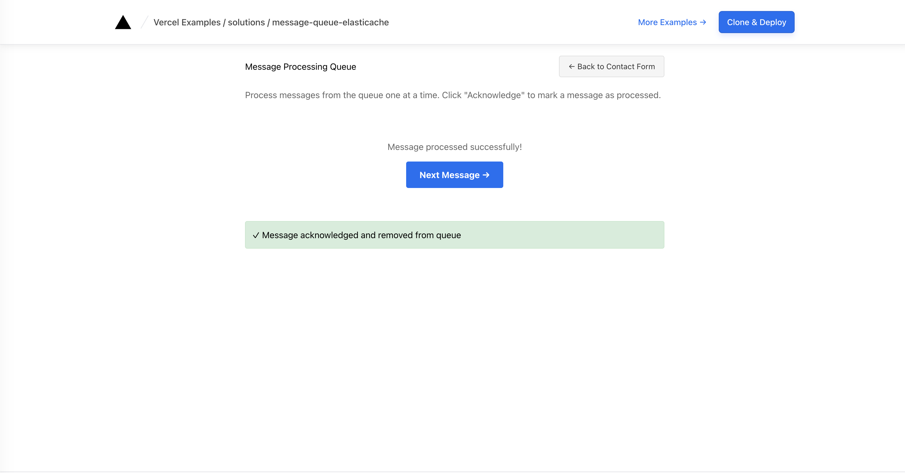
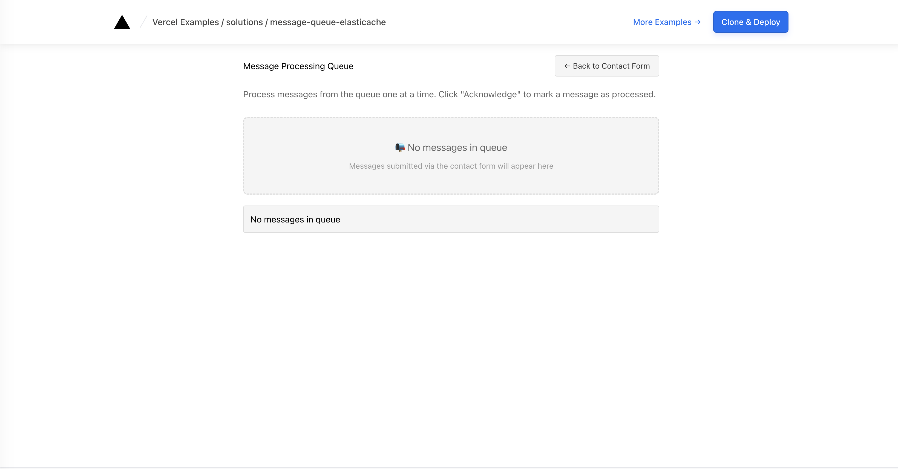

# Next.js + AWS ElastiCache Message Queue

This is an example of a Next.js application using AWS ElastiCache for implementing a reliable message queue with streams. The template demonstrates a contact form processor where messages are queued, consumed, and acknowledged using Valkey's streaming capabilities.

## How to Use

This template demonstrates the code pattern for implementing message queues with Valkey streams. It's designed to work with AWS ElastiCache in production environments.

### Local Development

Execute [`create-next-app`](https://github.com/vercel/next.js/tree/canary/packages/create-next-app) with [pnpm](https://pnpm.io/installation) to bootstrap the example:

```bash
pnpm create next-app --example https://github.com/vercel/examples/tree/main/solutions/message-queue-elasticache
```

**Run Valkey locally:**

Using Docker:

```bash
docker run -d -p 6379:6379 valkey/valkey:latest
```

Or install Valkey directly following the [official installation guide](https://valkey.io/topics/installation/).

**Configure environment:**

Create an `.env.local` file:

```bash
VALKEY_ENDPOINT=localhost:6379
```

**Start the development server:**

```bash
pnpm dev
```

Visit <http://localhost:3000> to see the application.

### Production Deployment with AWS ElastiCache

AWS ElastiCache clusters run within a VPC (private network), which requires network connectivity setup for production deployments on Vercel.

#### Networking Requirements

**For Vercel Enterprise customers**, connectivity to AWS ElastiCache is available through [Vercel Secure Compute](https://vercel.com/docs/connectivity/secure-compute), which enables private network access between Vercel Functions and AWS VPC resources.

**High-level setup steps:**

**AWS Side:**

1. Create an ElastiCache for Valkey cluster (version 7.0+) in your AWS VPC
2. Configure security groups to allow traffic from Vercel's CIDR block
3. Set up VPC peering or AWS PrivateLink based on your architecture
4. Note the cluster endpoint URL

**Vercel Side:**

1. Contact Vercel to enable Secure Compute for your Enterprise account
2. Coordinate with Vercel to receive your dedicated CIDR block
3. Add the ElastiCache endpoint to your project environment variables:

```bash
VALKEY_ENDPOINT=your-cluster.cache.amazonaws.com:6379
```

4. Deploy your application

[](https://vercel.com/new/clone?repository-url=https://github.com/vercel/examples/tree/main/solutions/message-queue-elasticache&project-name=message-queue-elasticache&repository-name=message-queue-elasticache&env=VALKEY_ENDPOINT&envDescription=Valkey%20endpoint%20URL)

For detailed networking configuration, refer to the [Vercel Secure Compute documentation](https://vercel.com/docs/connectivity/secure-compute).

## How It Works

This template demonstrates a reliable serverless message queue workflow:

1. **Producer**: A visitor submits a contact form, and the message is immediately written to a Valkey stream
2. **Consumer**: A reviewer opens the processing view, which reads the next unhandled message from the consumer group
3. **Acknowledgment**: When the reviewer confirms, the app acknowledges the message and removes it from the pending list

**Key Features:**

- Single consumer group prevents message duplication
- Message acknowledgment ensures reliable processing
- Refreshing the page won't cause duplicate processing
- Demonstrates how ElastiCache Streams support reliable serverless workflows

## API Endpoints

The application provides a single API route (`/api/messages`) with three HTTP methods demonstrating the message queue pattern:

### Message Operations

- `POST /api/messages` - Add a new message to the queue (contact form submission)
- `GET /api/messages` - Read the next unprocessed message from the consumer group
- `DELETE /api/messages?messageId=<id>` - Acknowledge and remove a message from the pending list

## Testing

**Important Notes:**

- Consumer groups track which messages have been delivered. Once a message is consumed (via GET), it moves to the Pending Entries List (PEL) and won't appear in subsequent GET requests until acknowledged.
- The `streamMessageId` returned by GET is Valkey's unique stream entry ID and **must be used** for the DELETE operation.
- Always complete the full flow: POST → GET → DELETE.

### Complete Message Flow Example

**1. Produce Message (Add to Queue)**

```bash
curl -X POST http://localhost:3000/api/messages \
  -H "Content-Type: application/json" \
  -d '{
    "name": "Test User",
    "email": "test@example.com",
    "message": "Hello from local dev!"
  }'
```

Response:

```json
{
  "streamMessageId": "1764009314892-0",
  "timestamp": "2024-11-24T18:35:14.890Z"
}
```

**2. Consume Message (Read from Queue)**

```bash
curl http://localhost:3000/api/messages
```

Response with message:

```json
{
  "message": {
    "streamMessageId": "1764009314892-0",
    "name": "Test User",
    "email": "test@example.com",
    "message": "Hello from local dev!",
    "timestamp": "2024-11-24T18:35:14.890Z",
    "claimed": true
  }
}
```

Response when queue is empty:

```json
{ "message": null }
```

**Note**: The `claimed` field indicates whether this message was recovered from the Pending Entries List (a previously delivered but unacknowledged message). Messages idle for more than 60 seconds are automatically reclaimed.

**3. Acknowledge Message (Mark as Processed)**

**Critical**: Use the `streamMessageId` from step 2 for the DELETE operation:

```bash
curl -X DELETE "http://localhost:3000/api/messages?messageId=1764009314892-0"
```

Response:

```json
{ "success": true }
```

### User Interface Flow

This template consists of two UI views that demonstrate the complete message queue workflow:

#### Submitting Messages (`/`)

The home page features a contact form where visitors can submit their name, email, and message. Upon submission, the message is immediately added to the Valkey stream and a confirmation is displayed.



#### Processing Messages (``)

The processing view allows reviewers to consume and acknowledge messages from the queue. The page loads the messages on page load and displays:

- Message details (name, email, message content)
- Timestamp when the message was submitted
- A warning banner if the message was recovered from the pending entries list



Clicking **Acknowledge** confirms the message and removes it from the queue. A success
message appears with a **Next Message** button to load the next message in the queue.



When the queue is empty, a "No message to process" indicator appears.



### Troubleshooting

**Message Recovery**: If you GET a message but don't DELETE (acknowledge) it, the message stays in the Pending Entries List. After 60 seconds of idle time, subsequent GET requests will **automatically reclaim** that message (indicated by `"claimed": true` in the response). This is a reliability feature that handles consumer failures.

**For clean testing**, if you want to reset and start fresh:

```bash
# Access your Valkey instance
docker exec -it <container_id> valkey-cli

# Delete the entire stream (removes consumer group too)
DEL contact-messages

# Or just delete the consumer group
XGROUP DESTROY contact-messages contact-processors

# The consumer group will be recreated automatically on next GET
```

**Checking Pending Messages**: To see what's currently in the Pending Entries List:

```bash
# Access Valkey
docker exec -it <container_id> valkey-cli

# View pending messages
XPENDING contact-messages contact-processors

# View all messages in the stream
XRANGE contact-messages - +
```
