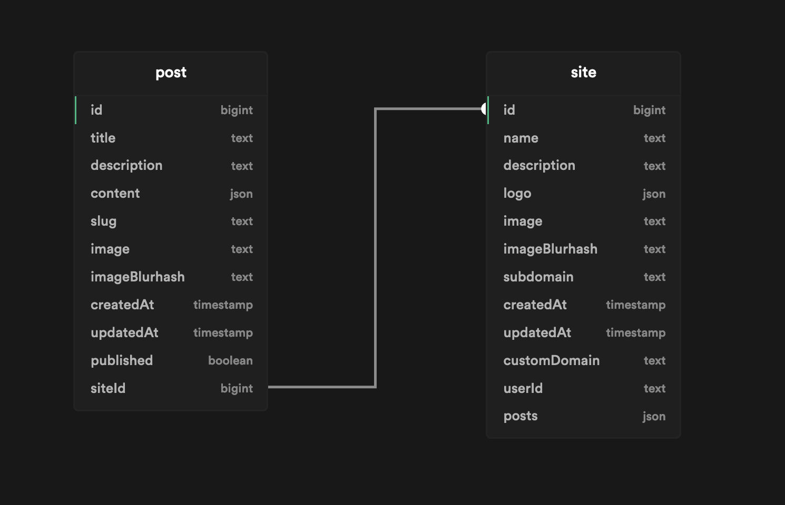

  <a href="https://vercel.com/platforms">
    
    <h3 align="center">Platforms Starter Kit</h3>
  </a>

Build a blogging platform based on Slate.js, Supabase and Vercel.
 

## Deploy Your Own

[Read the guide Platforms guide](https://vercel.com/guides/nextjs-multi-tenant-application) This solution builds upon this guide. The differences will be explained down bellow.

## Demo

[https://app.vercel.im/](https://app.vercel.im/)

## Differences with Platforms guide:

1. Skip the PlanetScale installation and instead create a database on [Supabase](https://supabase.com/) and replace the proper keys in the .env files.
2. Populate the database with the two necessary tables  You can use the following [script](./dbScript.sql) in the [supabase sql editor](https://supabase.com/docs/guides/database#the-sql-editor) to go faster

## Built on open source

This working demo site was built using the Platforms Starter Kit and:

- [Next.js](https://nextjs.org/) as the React framework
- [Tailwind](https://tailwindcss.com/) for CSS styling
- [Supabase](https://supabase.com/) as the database
- [NextAuth.js](https://next-auth.js.org/) for authentication
- [Vercel](http://vercel.com/) for deployment

## Contributing

- [Start a discussion](https://github.com/vercel/platforms/discussions) with a question, piece of feedback, or idea you want to share with the team.
- [Open an issue](https://github.com/vercel/platforms/issues) if you believe you've encountered a bug with the starter kit.
