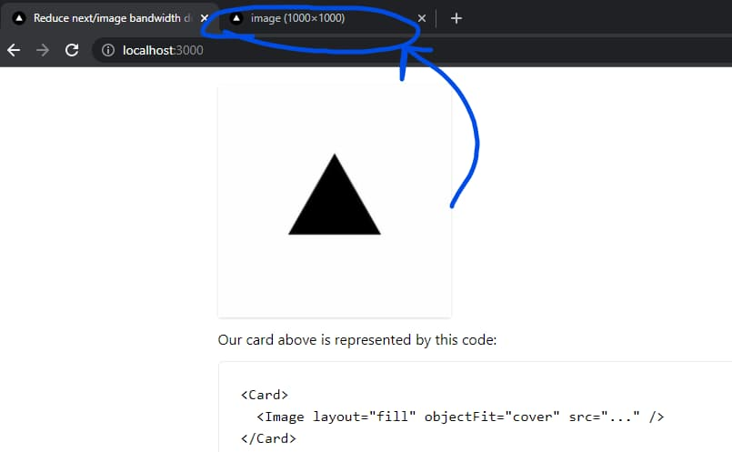
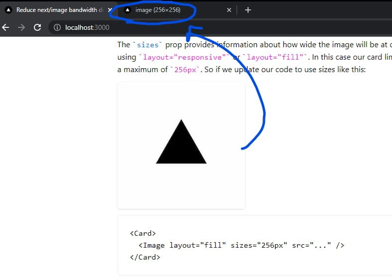

# Reduce next/image bandwidth usage

This example shows how to reduce bandwidth and processing costs when using different layouts.

## How to load optimized images using layout="fill" or layout="responsive"

Using [`layout=fill`](https://nextjs.org/docs/api-reference/next/image#layout) in `next/image` is one of the most common patterns as it let us use responsive parents and (along with the [`objectFit`](https://nextjs.org/docs/api-reference/next/image#objectfit) prop) our images will resize to it perfectly. But this leads to a common problem; as we don't know how large our parent might be, we can't serve an optimized image.

Our card is represented by this code:

```tsx
<Card>
  <Image layout="fill" src="..." />
</Card>
```

But wait, given this code we end up with this 👇



> Our element has a width of 256px but we are serving a 1000px image!

The [`sizes`](https://nextjs.org/docs/api-reference/next/image#sizes) prop provides information about how wide the image will be at different breakpoints when using `layout="responsive"` or `layout="fill"`. In this case our card limits the width of the card to a maximum of `256px`. So if we update our code to use sizes like this:

```tsx
<Card>
  <Image layout="fill" sizes="256px" src="..." />
</Card>
```



> Now we are being served with an optimized image.

We also have a lot of images available for different viewport sizes that will be generated (and cached) on demand just when needed. By default, a variant will be available for every [`device size`](https://nextjs.org/docs/api-reference/next/image#device-sizes) configured. But we can also specify [`image sizes`](https://nextjs.org/docs/api-reference/next/image#image-sizes) that will be concatenated to the variants generated by device sizes when using `layout="responsive"` or `layout="fill"`.

## How to load optimized images using layout="fixed" or layout="intrinsic"

This layouts force us to define a width and height of the image so its easier to determine the size of the variants that has to be generated so we don't have to define any extra properties to get an optimized image. So, given this code:

```tsx
<Card>
  <Image src="..." width={256} height={256} />
</Card>
```

> "intrinsic" is the default layout
> We get back a correct optimized image

## Demo

https://solutions-reduce-image-bandwidth-usage.vercel.sh

## How to Use

You can choose from one of the following two methods to use this repository:

### One-Click Deploy

Deploy the example using [Vercel](https://vercel.com?utm_source=github&utm_medium=readme&utm_campaign=vercel-examples):

[](https://vercel.com/new/clone?repository-url=https://github.com/vercel/examples/tree/main/solutions/reduce-image-bandwidth-usage&project-name=reduce-image-bandwidth-usage&repository-name=reduce-image-bandwidth-usage)

### Clone and Deploy

Execute [`create-next-app`](https://github.com/vercel/next.js/tree/canary/packages/create-next-app) with [pnpm](https://pnpm.io/installation) to bootstrap the example:

```bash
pnpm create next-app --example https://github.com/vercel/examples/tree/main/solutions/reduce-image-bandwidth-usage reduce-image-bandwidth-usage
```

Next, run Next.js in development mode:

```bash
pnpm dev
```

Deploy it to the cloud with [Vercel](https://vercel.com/new?utm_source=github&utm_medium=readme&utm_campaign=edge-middleware-eap) ([Documentation](https://nextjs.org/docs/deployment)).
