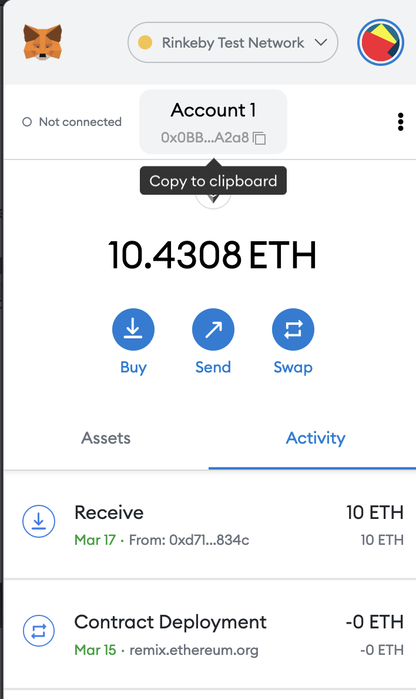
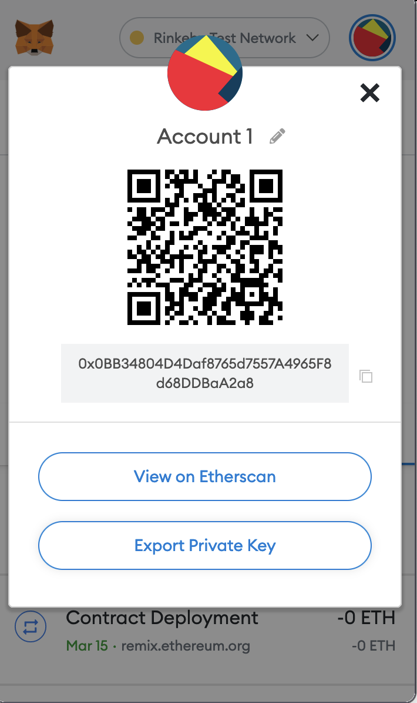

# token-gated-content example

This example shows how how to created gated token content with Next.js. It contains a sample NFT smart contract to get you started.

## Demo

https://token-gated-content.vercel.app

## How to Use

This example requires you to deploy a smart contract to the Rinkeby ethereum test network:

1. Ensure your Metamask wallet is set to use Rinkeby like [explained here](https://gist.github.com/tschubotz/8047d13a2d2ac8b2a9faa3a74970c7ef).
2. Grab your `address` in metamask and paste it in use it as the `PUBLIC_KEY` env var.
3. In Metamask click the 3 dots icon -> `account details` -> `export private key` and export your key to add it to `PRIVATE_KEY` **If using Mainnet, secure this properly! It can be used to access your wallet**.
   
4. Deploy your own version of the [smart contract](./contract/vercel.sol) to the Rinkeby network and grab the smart contract address to add it to `CONTRACT_ADDRESS` env variable. See this [tutorial](https://medium.com/quick-programming/how-to-deploy-a-smart-contract-using-remix-9e270b253249) on how to deploy smart contracts.
5. Give your application a proper name and add it to `NEXT_PUBLIC_APP_NAME` env var.

Then proceed to deploy as usual to Vercel.

You can choose from one of the following two methods to use this repository:

### One-Click Deploy

Deploy the example using [Vercel](https://vercel.com?utm_source=github&utm_medium=readme&utm_campaign=next-example):

[](https://vercel.com/new/git/external?repository-url=https://github.com/vercel/examples/tree/main/solutions/token-gated-content&project-name=token-gated-content&repository-name=token-gated-content)

### Clone and Deploy

Execute [`create-next-app`](https://github.com/vercel/next.js/tree/canary/packages/create-next-app) with [npm](https://docs.npmjs.com/cli/init) or [Yarn](https://yarnpkg.com/lang/en/docs/cli/create/) to bootstrap the example:

```bash
npx create-next-app --example https://github.com/vercel/examples/tree/main/solutions/token-gated-content
# or
yarn create next-app --example https://github.com/vercel/examples/tree/main/solutions/token-gated-content
```

Next, run Next.js in development mode:

```bash
npm install
npm run dev

# or

yarn
yarn dev
```

Deploy it to the cloud with [Vercel](https://vercel.com/new?utm_source=github&utm_medium=readme&utm_campaign=edge-middleware-eap) ([Documentation](https://nextjs.org/docs/deployment)).
